# Quant — A-Share Quantitative Trading System

`quant` 是一个面向 A 股市场的全栈量化交易系统，采用 **Kotlin Multiplatform (KMP)** 技术栈构建，覆盖数据获取、策略研究、回测验证、实盘信号生产到 Web/Android 双端呈现的完整链路。

---

## 目录

- [技术栈概览](#技术栈概览)
- [系统全景图](#系统全景图)
- [模块分层架构](#模块分层架构)
- [模块架构详解](#模块架构详解)
  - [前端层：compose-app](#前端层-compose-app)
  - [后端层：ktor-server](#后端层-ktor-server)
  - [策略层：strategy-server](#策略层-strategy-server)
  - [回测层：backtest](#回测层-backtest)
  - [数据层：database / network](#数据层-database--network)
  - [共享层：shared](#共享层-shared)
  - [AI Agent 层：agent](#ai-agent-层-agent)
  - [工具层：cli / tools](#工具层-cli--tools)
  - [代码生成层：ksp](#代码生成层-ksp)
- [核心数据流](#核心数据流)
- [架构设计亮点](#架构设计亮点)
- [快速开始](#快速开始)
- [部署模式](#部署模式)

---

## 技术栈概览

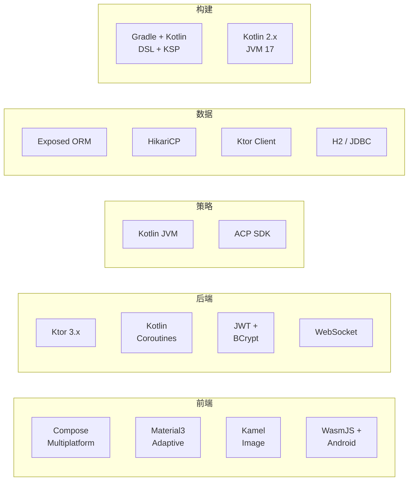

---

## 系统全景图

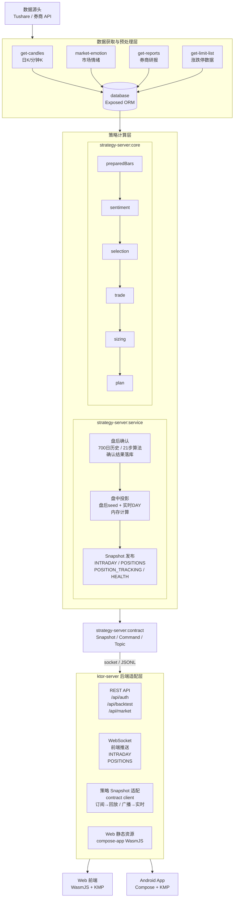

---

## 模块分层架构

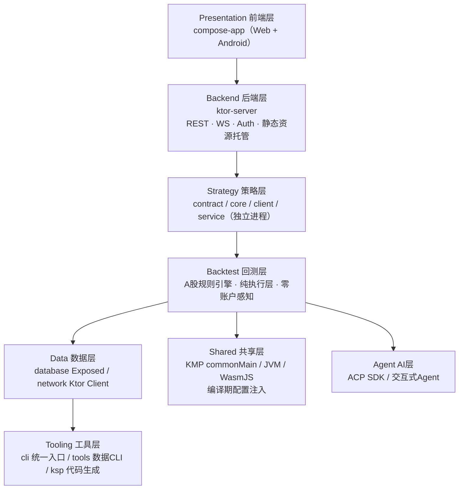

---

## 模块架构详解

### 前端层：compose-app

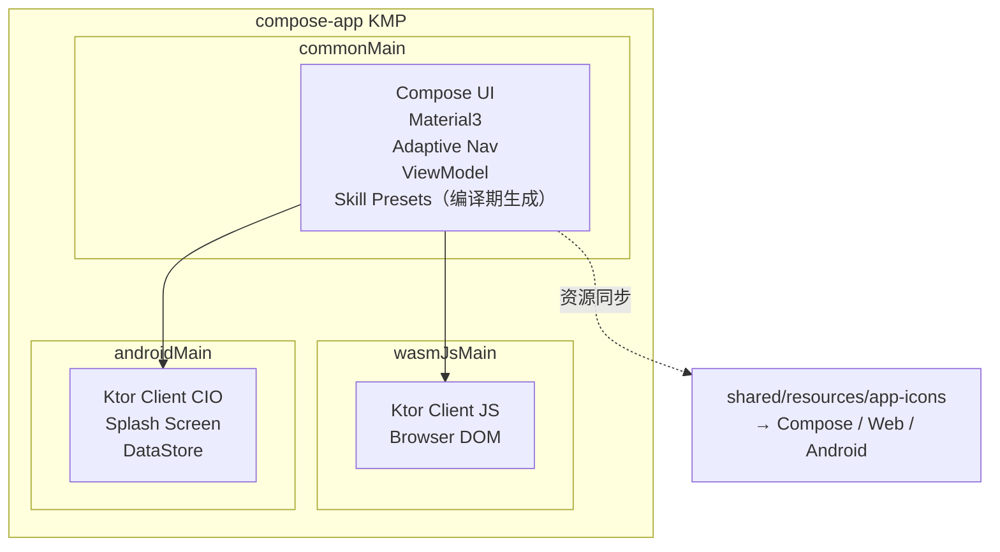

**核心设计**：
- **Material3 Adaptive 布局**：响应式导航套件，自适应手机/平板/桌面
- **跨平台 SVG 资源同步**：`syncCrossPlatformSvgAssets` Task 将 `shared/src/commonMain/resources/app-icons` 统一分发到三端
- **编译期 Skill Presets 生成**：扫描技能 metadata，自动生成前端技能列表代码
- **图片加载**：Kamel 跨平台图片库，支持 SVG 解码

**依赖**：`:shared`

---

### 后端层：ktor-server

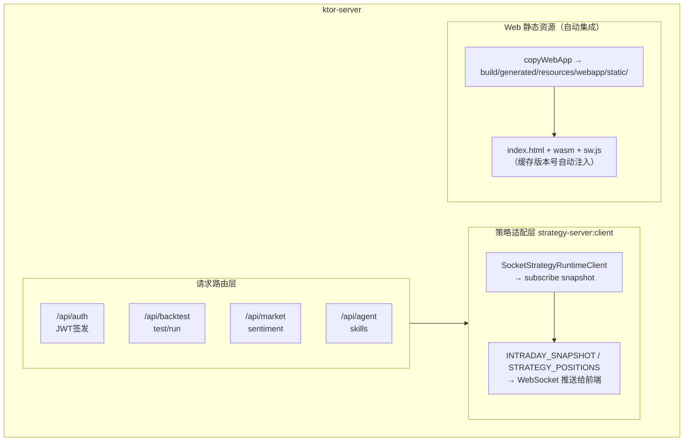

**核心设计**：
- **前端产物一体化部署**：`compose-app` WasmJS 产物自动复制到 Ktor 静态资源，缓存版本号自动注入
- **多模式运行时**：`debug` / `debug-wan` / `release` 三模式，通过 `quant.mode` 切换
- **Shadow Jar 部署包**：合并 SPI 服务文件，输出带目录结构的完整部署包
- **策略服务适配器**：Ktor 仅消费策略 Snapshot，不持有任何策略计算逻辑

**依赖**：`:network` `:database` `:backtest` `:shared` `:strategy-server:client` `:strategy-server:core` `:agent`

---

### 策略层：strategy-server

#### 五层架构

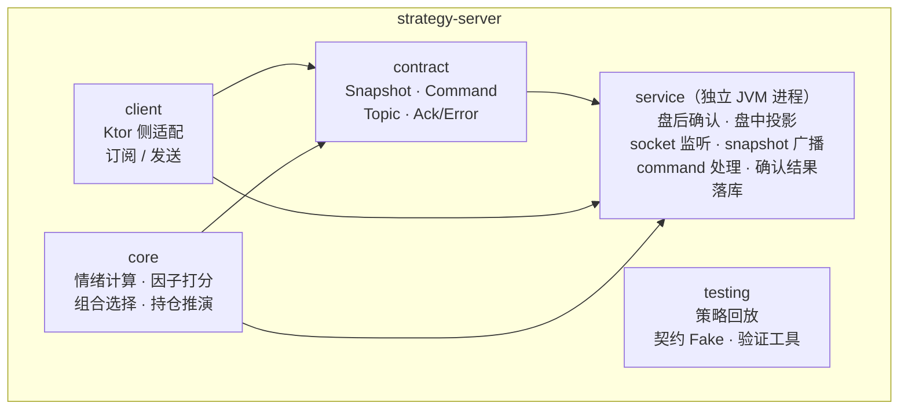

#### 盘后链路 vs 盘中链路

**盘后确认链路（每日收盘后执行）**

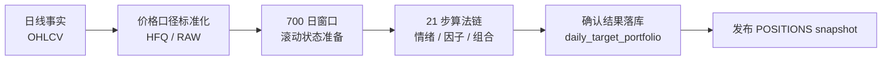

**盘中投影链路（交易时段实时刷新）**

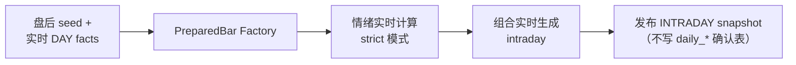

#### 四层策略计算体系

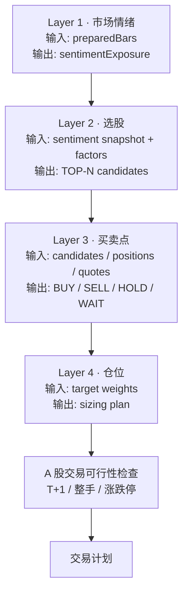

**边界约束**：

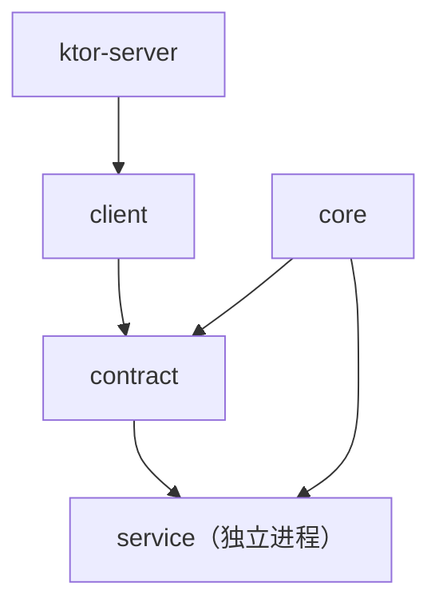

- `core` 允许依赖：`shared`（领域模型）
- `core` 严禁依赖：`database` / `network` / `ktor` / `service runtime`（策略内核必须保持纯算法，零 IO，零账户感知）
- `backtest` 允许依赖：`shared` / `database` / `contract`
- `backtest` 严禁依赖：`core` / `service` / `runtime`（回测是执行层，策略是决策层，不可反向耦合）

---

### 回测层：backtest

#### 核心设计：策略零账户感知

**传统耦合架构（❌）**

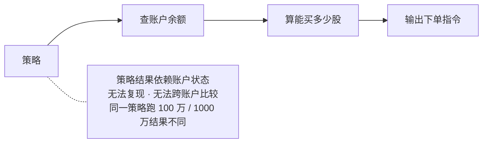

**解耦架构（✅）**

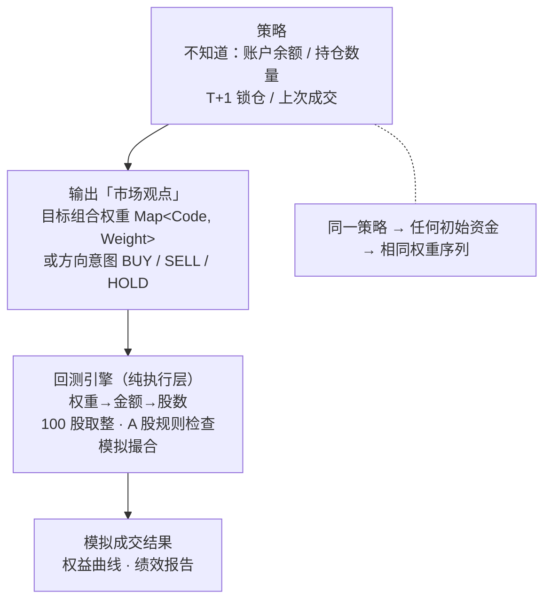

#### A 股规则引擎

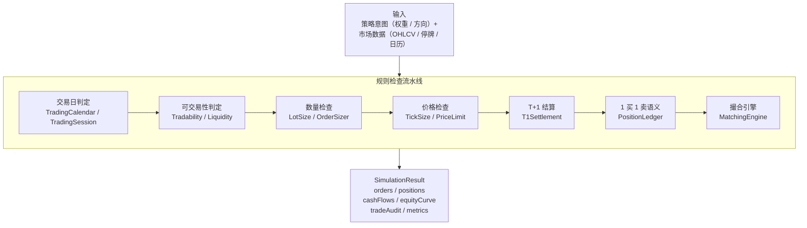

**边界约束**：

- `backtest` 允许依赖：
  - `:shared` — Candle / PriceBasis 等领域基础模型
  - `:database` — 行情、日历、停牌等市场数据读取
  - `:strategy-server:contract` — 策略输出契约适配
- `backtest` 严禁依赖：
  - `:strategy-server:core` / `:service`
  - 原因：策略层不允许感知账户私有域；反向耦合将破坏「策略零账户感知」边界

---

### 数据层：database / network

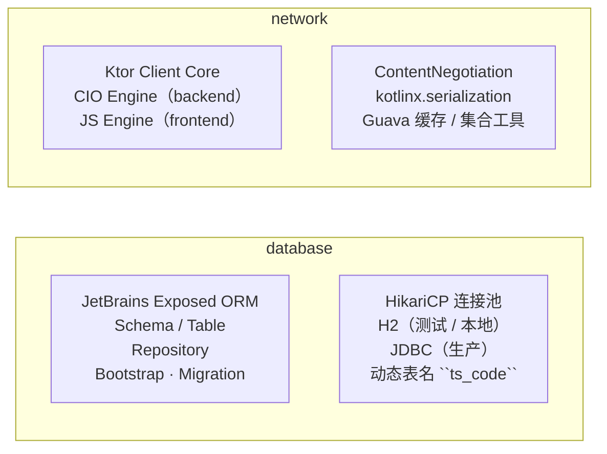

职责收束：`database` 只保留持久化职责；策略计算已迁至 `:strategy-server:core`。

---

### 共享层：shared

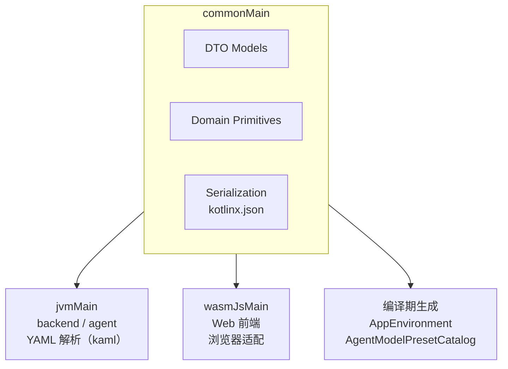

**generateAppEnvironment（编译期 Task）**

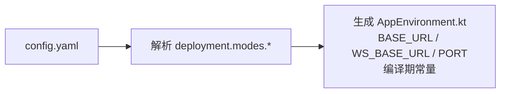

设计目标：前端零运行时配置解析，API 地址编译期锁定，安全无泄露。

---

### AI Agent 层：agent

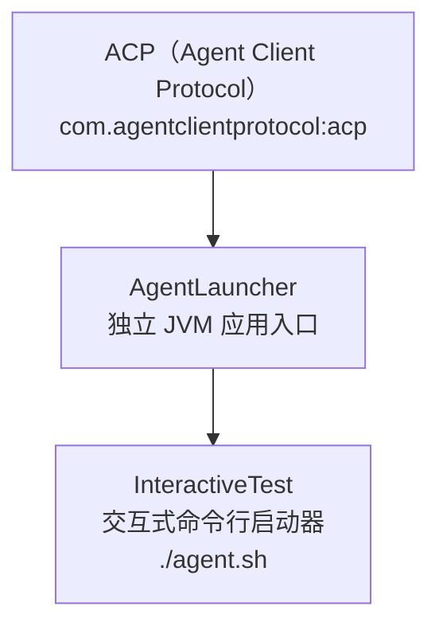

---

### 工具层：cli / tools

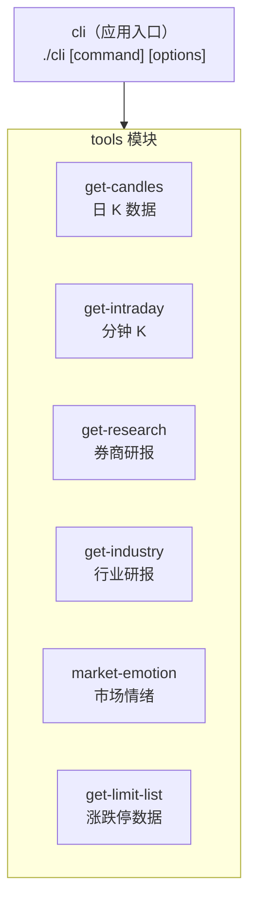

`cli` 同时装配 backtest 引擎 + database 直连，支持本地隔离模式回测。

---

## 核心数据流

### 端到端交易闭环

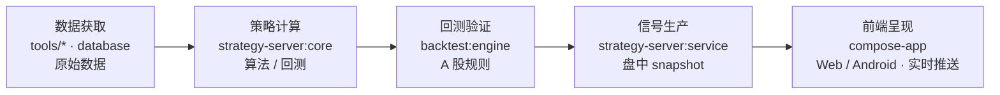

### 策略服务与 Ktor 的交互

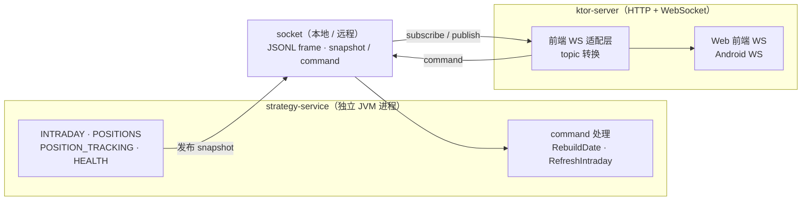

---

## 架构设计亮点

### 1. Kotlin Multiplatform 全栈统一

```mermaid
flowchart TB
    CM["commonMain（共享业务逻辑）<br/>DTO / 序列化 / 领域模型"]
    CM --> JVM["jvmMain"] --> BE["backend<br/>Ktor"]
    CM --> WASM["wasmJsMain"] --> WEB["Web 前端<br/>浏览器"]
    CM --> AND["androidMain"] --> APP["Android App"]
```

- **一门语言贯穿全链路**：前端、后端、策略内核全部 Kotlin
- **shared 消除 DTO 重复**：前后端共用同一套序列化模型
- **expect/actual 机制**：网络、存储、时间等能力跨平台统一抽象

### 2. 策略服务独立化

**迭代前（耦合）**

```mermaid
flowchart TB
    K1["Ktor<br/>策略计算 + API"] --> DOWN["修改策略需重启整个后端<br/>全站宕机"]
```

**迭代后（解耦）**

```mermaid
flowchart LR
    K2["Ktor（adapter）"] <--> SVC["strategy-service<br/>独立进程"]
    K2 --> USER["前端用户<br/>零感知升级"]
    SVC -.- NOTE["Agent 修改策略：只需重启 service<br/>Ktor 不中断"]
```

- **内核与运行时分离**：`core` 纯算法库，多场景复用
- **进程级隔离**：Agent 迭代策略后只需重启 service
- **契约驱动通信**：`contract` 定义协议，实现可替换
- **权责唯一**：四大 topic 唯一 owner，杜绝双写冲突

### 3. 回测引擎「策略零账户感知」

```mermaid
flowchart TB
    S["策略输出 → 市场观点（权重 / 方向）<br/>策略不知道：账户余额 / 持仓数量 /<br/>T+1 锁仓 / 上次成交结果"]
    E["回测引擎 → 内化模拟账户 → A 股规则检查 → 模拟撮合<br/>回测知道：可用现金 / 总权益 ·<br/>可用持仓 / 冻结持仓 ·<br/>整手取整 / T+1 结算 ·<br/>涨跌停 / 停牌 / 流动性"]
    R["执行结果<br/>权益曲线 · 绩效报告"]
    RULE["同一策略 → 任何初始资金 → 相同权重序列"]

    S --> E --> R
    R -.- RULE
```

- **策略可复现**：不受账户状态污染
- **回测↔实盘对齐**：替换 `AccountLedger` 即可接入实盘
- **多账户并行**：同一策略同时跑多档资金规模

### 4. A 股交易规则精确建模

```mermaid
flowchart TB
    IN["策略意图"]
    subgraph PIPE["规则检查流水线（每条规则 = 独立可测类）"]
        R1["TradingCalendar<br/>是否交易日？"]
        R2["TradabilityRule<br/>是否停牌 / 退市？"]
        R3["PriceLimitRule<br/>是否涨停 / 跌停？"]
        R4["LotSizeRule<br/>买入 100 股整数倍？"]
        R5["T1SettlementRule<br/>可卖数量 ≥ 卖出量？"]
        R6["LiquidityRule<br/>成交量足够？"]
        R7["PositionLedger<br/>1 买 1 卖语义检查"]
        R8["MatchingEngine<br/>撮合成交"]
        R1 --> R2 --> R3 --> R4 --> R5 --> R6 --> R7 --> R8
    end
    IN --> PIPE
```

### 5. 编译期配置安全注入

```mermaid
flowchart TB
    YAML["config.yaml<br/>唯一真理源"]
    TASK["generateAppEnvironment<br/>Gradle Task（编译期）<br/>读取 deployment.modes.*<br/>生成 AppEnvironment.kt"]
    OBJ["object AppEnvironment {<br/>const val API_BASE_URL = ...<br/>const val WS_BASE_URL = ...<br/>const val PORT = ...<br/>}<br/>编译期常量 · 运行时零解析"]

    YAML --> TASK --> OBJ
```

- 前端不携带运行时配置解析逻辑
- API / WebSocket 地址编译期锁定
- 模型预设零 API Key 泄露

### 6. 跨平台 SVG 资源统一管理

```mermaid
flowchart TB
    SRC["shared/src/commonMain/resources/app-icons/<br/>brand_mark.svg<br/>web/icon.svg<br/>android/ic_launcher_*.xml<br/>android/ic_splash_logo.xml"]
    TASK["syncCrossPlatformSvgAssets<br/>Gradle Task"]
    OUT1["composeResources/drawable/"]
    OUT2["wasmJsMain/resources/"]
    OUT3["androidMain/res/drawable/"]

    SRC --> TASK
    TASK --> OUT1
    TASK --> OUT2
    TASK --> OUT3
```

- 单一数据源，三端同步
- 修改一处，全局生效

### 7. 多模式部署与版本管理

**部署模式矩阵**

| 模式 | 用途 | 前端产物 | 配置源 |
|------|------|----------|--------|
| debug | 本地开发 | development | `modes.debug` |
| debug-wan | 局域网调试 | development | `modes.debug-wan` |
| release | 生产部署 | production | `modes.release` |

切换方式：`-Pquant.mode=xxx` 或 `QUANT_MODE=xxx`。

**部署包结构**

```mermaid
flowchart TB
    ROOT["quant-server-x.x.x-mode/"]
    ROOT --> BIN["bin/<br/>启动脚本 .sh / .bat"]
    ROOT --> LIB["lib/<br/>fat JAR（shadowJar）"]
    ROOT --> CFG["config/<br/>YAML 配置"]
    ROOT --> LOG["logs/<br/>运行时日志"]
    ROOT --> DAT["data/<br/>持久化数据"]
    ROOT --> SS["strategy-service/<br/>独立策略服务"]
```

打包命令：

```bash
./gradlew :ktor-server:packageDebug
./gradlew :ktor-server:packageRelease
```

---

## 快速开始

### 环境要求

- JDK 17+
- Gradle 8.x（wrapper 已包含）
- Node.js（前端 Web 构建）

### 构建命令

```bash
# 全量构建
./gradlew build

# 后端服务器
./gradlew :ktor-server:run

# Web 前端开发服务器
./gradlew :compose-app:wasmJsBrowserDevelopmentRun

# Android 安装
./gradlew :compose-app:installDebug

# 策略服务独立运行
./gradlew :strategy-server:service:run

# CLI 工具
./gradlew :cli:installDist
./cli get-candles --code 000001.SZ
```

### 配置

- 复制 `config.example.yaml` 为 `config.yaml`，填入私有配置
- `shared` 模块编译期自动读取 `config.yaml` 生成 `AppEnvironment`
- `compose-app` 的 `keystore.properties` 用于 Android release 签名（可选）

---

## 部署模式

| 模式 | Gradle 属性 | 用途 | 前端产物 | 端口来源 |
|------|-------------|------|----------|----------|
| debug | `-Pquant.mode=debug` | 本地开发 | developmentExecutable | `config.yaml` 中 `deployment.modes.debug` |
| debug-wan | `-Pquant.mode=debug-wan` | 局域网调试 | developmentExecutable | `config.yaml` 中 `deployment.modes.debug-wan` |
| release | `-Pquant.mode=release` | 生产部署 | productionExecutable | `config.yaml` 中 `deployment.modes.release` |

```bash
# 打包 debug 部署包
./gradlew :ktor-server:packageDebug -Pquant.mode=debug

# 打包 release 部署包（含 Android APK）
./gradlew :ktor-server:packageRelease -Pquant.mode=release
```
