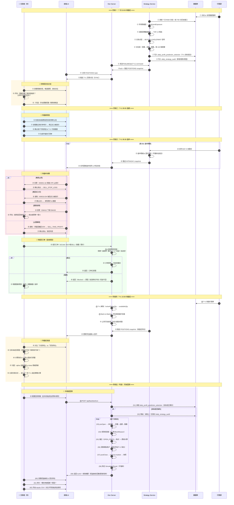

# A 股交易策略流程体系

本文档从真实交易者执行角度，定义 `strategy-server` 后续应落地的完整交易流程。目标不是只生成“明天选哪几只”，而是把市场情绪、选股、买卖点、仓位、交易约束、执行反馈串成闭环。

## 1. 设计目标

策略体系按四层组织:

1. 市场情绪
2. 基于市场情绪的选股
3. 基于市场情绪的选股结果买卖点分析
4. 基于市场情绪的选股结果仓位分析

真实交易闭环还必须接入 A 股交易约束:

- 普通 A 股股票卖出遵循 T+1，可用仓位与今日买入仓位必须分开。
- 竞价买入申报数量按 100 股或其整数倍处理；卖出可一次性处理不足 100 股的零股余额。
- A 股价格最小变动单位为 0.01 元。
- 主板常规涨跌幅按 10% 处理；科创板/创业板等 20% 标的不是当前主板策略默认交易池。
- 涨停不可买入、跌停不可卖出、停牌不可交易、成交量不足时不能假设按目标仓位完整成交。
- 策略默认只生成常规竞价交易计划；盘后固定价格交易作为后续扩展能力，不进入默认执行闭环。

> 规则依据: 上交所与深交所交易规则公开材料。上交所 2026 年修订已将盘后固定价格交易扩展到全部 A 股，并将主板风险警示股票涨跌幅限制比例调整为 10%。策略实现时应以运行日期生效规则和交易所公告为准。

## 2. 总体业务链路

```text
日线事实 / 盘中 DAY 实时事实
  -> 价格口径标准化
  -> 市场情绪层
  -> 情绪约束下的选股层
  -> 买卖点分析层
  -> 仓位分析层
  -> A 股交易可行性检查
  -> 交易计划
  -> 订单执行 / 成交回报
  -> 实际持仓 / 资金 / 风控状态
  -> 复盘归因
  -> 次日策略状态继承
```

盘后链路产出下一交易日计划。盘中链路只做实时投影和交易计划修正，不直接覆盖盘后确认结果。任何“目标仓位”都必须经过交易可行性检查后，才能变成“可执行订单”。

## 3. 分层数据流

### 3.1 市场情绪层

业务问题: 当前市场是否值得承担股票暴露，最多承担多少总仓位。

输入:

| 入参 | 说明 |
| --- | --- |
| `tradeDate` | 计算日期 |
| `universe` | 当前策略股票池，默认主板 active 股票 |
| `preparedBarsBySymbol` | 标准化后的历史行情，默认信号口径 HFQ，执行口径 RAW |
| `previousSentimentState` | 前一交易日市场情绪滚动状态 |
| `realtimeDayFacts` | 盘中实时 DAY K 事实，仅盘中使用 |
| `calendarState` | 交易日、是否开市、是否盘后 |

处理:

```text
样本股趋势扩散度
  -> bullRatio
  -> ratioNorm
  -> FFT 周期相位
  -> residual 周期残差
  -> marketVol / volZ
  -> accelZ
  -> guard: absoluteFloor / volCap
  -> sentimentExposure
```

输出:

| 出参 | 说明 |
| --- | --- |
| `MarketSentimentSnapshot` | 当日市场情绪快照 |
| `sentimentExposure` | 市场情绪水位，范围 `[0, 1]`，仅作情绪审计/展示 |
| `riskMode` | 建议新增: `RISK_OFF / DEFENSIVE / NEUTRAL / AGGRESSIVE` |
| `emptyReason` | 模型无结果、历史不足等无法生成确认选股的原因 |
| `MarketSentimentRollingState` | 次日增量计算所需状态 |
| `SentimentRuntimeSeed` | 盘中实时投影种子 |

交易解释:

- `sentimentExposure == 0`: 只表示市场情绪保护触发；不再过滤 7% 盈利预测模型 Top5。
- 低情绪但未归零: 仅作为情绪审计/展示，不改变模型选股列表。
- 高波动触发 `volCap`: 仅作为情绪审计/展示，不改变模型选股列表。

### 3.2 基于市场情绪的选股层

业务问题: 在允许承担风险的前提下，今天哪些股票值得进入候选组合。

输入:

| 入参 | 说明 |
| --- | --- |
| `MarketSentimentSnapshot` | 市场情绪层输出 |
| `StockFactorSnapshot[]` | 个股因子快照 |
| `universe` | 主板股票池 |
| `tradabilityFacts` | 停牌、ST、涨跌停、成交额、上市天数等可交易性事实 |
| `currentPositions` | 当前真实持仓，用于保留/退出判断 |

处理:

```text
universe
  -> 可交易性预过滤
  -> signal && sufficientHistory
  -> 情绪驱动因子权重调整
  -> momentum / volume / adaptive momentum 横截面 percentile rank
  -> selectionScore
  -> TOP_N 候选
```

输出:

| 出参 | 说明 |
| --- | --- |
| `SelectionCandidate[]` | 选股候选，包含 `selectionScore`、因子拆解、排序原因 |
| `selectedCodes` | TOP_N 代码列表，默认最多 5 只 |
| `selectionRejected[]` | 被过滤股票及原因，例如停牌、涨停不可买、历史不足、信号失效 |
| `candidateRiskTags` | 个股风险标签，例如高波动、量能不足、临近跌停 |

交易解释:

- `rankScore` 只表示单股因子快照，不作为最终组合排序依据。
- `selectionScore` 是组合横截面最终分数。
- 情绪强时提高自适应动量权重，情绪弱时提高趋势稳健权重。
- 选股层只回答“哪些股票值得研究/进入组合”，不直接回答“现在是否买、买多少”。

### 3.3 买卖点分析层

业务问题: 对入选股票和已有持仓，给出真实可执行的买入、卖出、等待或观察计划。

输入:

| 入参 | 说明 |
| --- | --- |
| `SelectionCandidate[]` | 选股层输出 |
| `MarketSentimentSnapshot` | 情绪层输出 |
| `currentPositions` | 当前真实持仓，包含可卖数量、成本价、持仓天数 |
| `realtimeQuote / dayCandle` | 当前价、开高低收、成交量、买卖盘口 |
| `previousClose` | 用于涨跌停价格计算 |
| `factorState` | EMA/ATR/stopPrice/holdingDays 等个股状态 |
| `tradeCalendar` | T/T+1 可交易日期 |

处理:

```text
候选股票:
  -> 是否涨停/停牌/流动性不足
  -> 是否回踩/突破/趋势延续
  -> 买入触发价与失效价
  -> 计划买入

已有持仓:
  -> T+1 可卖数量检查
  -> ATR 追踪止损
  -> EMA 趋势反转
  -> 跌出 TOP_N
  -> 情绪降仓
  -> 盈利保护 / 止盈
  -> 计划卖出或继续持有
```

输出:

| 出参 | 说明 |
| --- | --- |
| `TradeSignal[]` | `BUY / SELL / HOLD / WAIT / REDUCE / ADD` |
| `entryPlan` | 买入触发价、允许追价上限、失效条件 |
| `exitPlan` | 止损价、止盈/保护利润条件、趋势退出条件 |
| `executionWindow` | 建议执行时段，例如次日开盘后、尾盘确认、盘中触发 |
| `signalReason` | 可审计的买卖原因 |
| `signalInvalidation` | 信号失效条件 |

建议买入规则:

- 盘后入选且情绪允许开仓，次日进入买入观察。
- 如果开盘一字涨停、停牌、盘口无有效成交，不追单，记录为 `WAIT_LIMIT_UP_OR_SUSPENDED`。
- 如果开盘大幅高开超过计划追价上限，等待回落或放弃，避免把选股信号变成无约束追涨。
- 买入价格必须落在涨跌幅限制范围内，并按 0.01 元价格档处理。

建议卖出规则:

- 跌破 ATR 追踪止损价: `SELL_STOP_LOSS`。
- EMA10 重新弱于 EMA30 或趋势状态失效: `SELL_TREND_EXIT`。
- 跌出 TOP_N 且没有持仓保留理由: `SELL_ROTATION`。
- 情绪仓位下降导致组合总仓位需要降低: `REDUCE_SENTIMENT_DELEVERAGE`。
- 达到盈利保护条件: `SELL_TAKE_PROFIT` 或 `REDUCE_PROFIT_PROTECTION`。

建议补充止盈规则:

```text
浮盈达到 2R:
  上移保护价到成本价或 1R 附近

浮盈达到 3R 且短期加速:
  可减仓 1/3 ~ 1/2，剩余仓位跟随 ATR 追踪止盈

最高浮盈回撤超过 1R 或 50%:
  触发利润保护卖出
```

其中 `R = entryPrice - initialStopPrice`。止盈不应孤立按固定百分比处理，应和止损距离、情绪、趋势质量绑定。

### 3.4 仓位分析层

业务问题: 在市场情绪允许的总风险下，每只股票到底买多少，组合是否过度集中。

输入:

| 入参 | 说明 |
| --- | --- |
| `sentimentExposure` | 情绪给出的总仓位上限 |
| `TradeSignal[]` | 买卖点层输出 |
| `accountState` | 总资产、可用现金、真实持仓、市值、冻结资金 |
| `riskBudget` | 单笔最大亏损、组合最大回撤、行业集中度限制 |
| `entryPrice / stopPrice` | 买入计划价与初始止损价 |
| `tradabilityFacts` | 最小交易单位、涨跌停、停牌、流动性 |

处理:

```text
情绪总仓位上限
  -> 单票风险预算
  -> 按止损距离计算风险仓位
  -> 按 TOP_N 等权上限计算组合仓位
  -> 按现金/整手/流动性修正
  -> 生成目标订单数量
```

输出:

| 出参 | 说明 |
| --- | --- |
| `PositionPlan[]` | 每只股票目标市值、目标股数、目标权重 |
| `cashPlan` | 预留现金、预计买入金额、预计卖出回款 |
| `riskPlan` | 单票最大亏损、组合最大亏损、止损触发后的预估损失 |
| `orderIntent[]` | 可执行订单意图，尚未等同于真实委托 |
| `positionAdjustReason` | 仓位被下调原因，例如情绪不足、止损距离过宽、现金不足、非整手 |

仓位规则:

- 模型确认组合按 Top5 等权，`target_weight = 1.0 / selectedCount`。
- `sentimentExposure` 不再约束确认组合权重，只保留为情绪审计字段。
- 真实买入数量应同时满足:

```text
按权重得到的目标金额
按单票风险预算得到的最大金额
可用现金
100 股整数倍
流动性上限
涨跌停/停牌约束
```

风险仓位公式:

```text
singleRiskAmount = accountEquity * singleTradeRiskPct
riskPerShare = entryPrice - initialStopPrice
riskBasedShares = floor(singleRiskAmount / riskPerShare)
```

最终股数:

```text
targetShares = min(weightBasedShares, riskBasedShares, cashBasedShares, liquidityBasedShares)
targetShares = floor(targetShares / 100) * 100
```

卖出时:

- T+1 可卖数量优先于目标数量。
- 不足 100 股零股余额可一次性卖出。
- 跌停不可假设成交，只能生成卖出意图并进入 `PENDING_LIMIT_DOWN_EXIT`。

## 4. 交易可行性层

这一层不产生 alpha，只负责防止策略计划违反 A 股交易现实。

输入:

| 入参 | 说明 |
| --- | --- |
| `PositionPlan[]` | 仓位层输出 |
| `realtimeQuote` | 当前价、盘口、涨跌停状态 |
| `securityStatus` | 停牌、退市整理、风险警示、新股前五日等状态 |
| `holdingLots` | 今日可卖数量、今日买入不可卖数量 |
| `accountState` | 可用资金、冻结资金、实际持仓 |

输出:

| 出参 | 说明 |
| --- | --- |
| `ExecutableOrderPlan[]` | 可提交订单计划 |
| `BlockedOrder[]` | 被交易规则或市场状态阻断的订单 |
| `PendingAction[]` | 等待条件满足后重试的动作 |

检查项:

- 买入数量是否为 100 股整数倍。
- 卖出数量是否不超过 T+1 可卖数量。
- 委托价格是否按 0.01 元价格档取整。
- 委托价格是否在涨跌停范围内。
- 买入是否遇到涨停无成交可能。
- 卖出是否遇到跌停无成交可能。
- 标的是否停牌或状态不可交易。
- 是否有足够可用资金。

## 5. 交易执行与反馈闭环

完整闭环必须区分四类状态:

```text
TargetPosition: 策略想持有什么
TradePlan: 计划怎样交易
Order: 实际提交了什么委托
ActualPosition: 真实成交后持有什么
```

执行反馈流:

```text
ExecutableOrderPlan
  -> submit order
  -> order accepted / rejected
  -> partial filled / filled / cancelled
  -> actual position update
  -> cash update
  -> execution slippage
  -> strategy audit
  -> next day state seed
```

需要落库或快照的核心对象:

| 对象 | 用途 |
| --- | --- |
| `daily_trade_plan` | 盘后生成的下一交易日交易计划 |
| `intraday_trade_plan` | 盘中实时修正计划 |
| `order_intent` | 策略生成但尚未提交的订单意图 |
| `order_execution` | 委托、成交、撤单、拒单记录 |
| `actual_position` | 真实持仓、成本、可卖数量 |
| `risk_state` | 组合回撤、连续亏损、冷却期、风控开关 |
| `trade_audit` | 每笔交易原因、预期风险、实际滑点、归因结果 |

## 6. 端到端策略流转

### 6.1 盘后生成次日计划

```text
T 日收盘后
  -> 更新日线和复权事实
  -> 市场情绪层产出 sentimentExposure
  -> 选股层产出 TOP_N 候选
  -> 买卖点层为候选和持仓生成 BUY / SELL / HOLD / WAIT
  -> 仓位层生成目标金额和目标股数
  -> 交易可行性层按 A 股规则过滤
  -> 写入 T+1 交易计划
```

输出:

```text
NextSessionTradePlan(
  targetDate,
  marketRegime,
  sentimentExposure,
  candidates,
  tradeSignals,
  positionPlans,
  executableOrders,
  blockedOrders,
  riskSummary
)
```

### 6.2 次日盘前校验

```text
T+1 盘前
  -> 读取昨晚交易计划
  -> 检查停牌、风险警示、账户现金、可卖数量
  -> 根据集合竞价参考价更新买卖触发条件
  -> 生成开盘执行清单
```

### 6.3 盘中执行与调整

```text
盘中
  -> 读取实时 DAY fact
  -> 更新情绪投影和因子投影
  -> 对未成交计划做有效性检查
  -> 对持仓执行止损/止盈/降仓检查
  -> 生成新增、撤销、减仓或等待动作
```

盘中默认不应频繁重排全组合。建议分成三类触发:

- 硬风控触发: 止损、跌停风险、组合回撤。
- 计划执行触发: 到达买入/卖出触发价。
- 观察更新触发: 只刷新展示，不生成订单。

### 6.4 收盘后复盘

```text
收盘后
  -> 汇总订单成交
  -> 对比计划仓位与实际仓位
  -> 计算滑点、未成交原因、止损/止盈执行质量
  -> 更新 actual_position / risk_state / trade_audit
  -> 进入下一轮盘后策略计算
```

## 7. 策略分层接口草案

```kotlin
data class MarketSentimentInput(
    val tradeDate: LocalDate,
    val universe: List<String>,
    val barsBySymbol: Map<String, List<PreparedBar>>,
    val previousState: MarketSentimentRollingState?,
)

data class MarketSentimentOutput(
    val snapshot: MarketSentimentSnapshot,
    val riskMode: RiskMode,
    val nextState: MarketSentimentRollingState?,
    val runtimeSeed: SentimentRuntimeSeed?,
)

data class SelectionInput(
    val sentiment: MarketSentimentSnapshot,
    val factors: List<StockFactorSnapshot>,
    val tradability: Map<String, TradabilityFact>,
    val currentPositions: List<ActualPosition>,
)

data class SelectionOutput(
    val candidates: List<SelectionCandidate>,
    val rejected: List<RejectedCandidate>,
)

data class EntryExitInput(
    val sentiment: MarketSentimentSnapshot,
    val candidates: List<SelectionCandidate>,
    val positions: List<ActualPosition>,
    val marketFacts: Map<String, MarketFact>,
    val factorStates: Map<String, FactorRollingState>,
)

data class EntryExitOutput(
    val signals: List<TradeSignal>,
)

data class PositionSizingInput(
    val sentiment: MarketSentimentSnapshot,
    val signals: List<TradeSignal>,
    val account: AccountState,
    val riskPolicy: RiskPolicy,
    val tradability: Map<String, TradabilityFact>,
)

data class PositionSizingOutput(
    val plans: List<PositionPlan>,
    val riskSummary: PortfolioRiskSummary,
)

data class ExecutionFeasibilityOutput(
    val executableOrders: List<ExecutableOrderPlan>,
    val blockedOrders: List<BlockedOrder>,
    val pendingActions: List<PendingAction>,
)
```

## 8. 当前 strategy-server 与目标体系差距

当前已具备:

- 市场情绪快照和 `sentimentExposure`。
- 主板股票池。
- 日频因子、盘中因子投影。
- TOP 5 目标组合。
- 情绪仓位均分。
- 盘中 BUY / SELL / HOLD 建议。

需要补齐:

- 买卖点分析层: 明确买入触发、失效、止损、止盈、趋势退出、轮换退出。
- 真实仓位层: 从目标权重升级为风险预算、整手、现金、可卖数量共同约束。
- 交易可行性层: 涨跌停、停牌、T+1、100 股整手、0.01 价格档。
- 订单执行层: 委托、成交、撤单、拒单、部分成交。
- 实际持仓层: 成本价、可卖数量、浮盈亏、今日买入不可卖。
- 组合级风控: 回撤、连续亏损、冷却期、策略失效降仓。
- 复盘归因: 信号原因、交易原因、未成交原因、滑点和收益归因。

## 9. 官方规则参考

- 上海证券交易所，交易机制说明: https://english.sse.com.cn/start/trading/mechanism/
- 上海证券交易所，2026 年交易规则修订发布说明: https://www.sse.com.cn/aboutus/mediacenter/hotandd/c/c_20260424_10816474.shtml
- 深圳证券交易所，《深圳证券交易所交易规则》公开 PDF: https://docs.static.szse.cn/www/lawrules/rule/stock/trade/W020230217564423808793.pdf

## 10. 与回测模块的衔接

回测模块是策略确认结果的执行层，不重新选股、不重新计算情绪或因子。

策略侧输出到回测的主链路：

```text
daily_profit_prediction_selection
  -> DbBackedDecisionFeed.targetRowsFor(target_date)
  -> TargetPortfolioDecision(effectiveDate=target_date, targetWeights, sentimentExposure)
  -> OrderSizer 在回测账户私有域内折算股数
```

字段适配：

| 策略确认字段 | 回测字段 | 语义 |
| --- | --- | --- |
| `target_date` | `effectiveDate` | 目标组合实际执行日 |
| `ts_code` | `targetWeights` key | 股票代码，保留交易所后缀 |
| `selected` + `target_weight` | `targetWeights[tsCode]` | 仅 `selected=true` 且权重大于 0 的行进入目标组合 |
| `sentiment_exposure` | `sentimentExposure` | 市场情绪水位，仅作审计/展示参考，不约束确认组合 |
| `selection_reason` / `selection_score` | `reason` | 只作为可读审计原因，不参与账户计算 |

降级链路：

```text
daily_strategy_audit.newly_selected_json / dropped_json
  -> TradeIntentDecision(BUY / SELL)
```

该降级只在 `daily_profit_prediction_selection` 对应目标日没有记录时启用，并按 `target_date` 的上一交易日读取 `daily_strategy_audit.trade_date`，避免把 T 日盘后审计信号错配到 T+1 之后才执行；同时避免同一股票既被目标组合又被审计列表重复转成交易意图。

边界要求：

- 策略输出必须保持零账户感知，不携带现金、数量、持仓、可卖数量等字段。
- 回测内部的权重到金额、金额到股数、现金不足缩放、T+1、涨跌停、整手、撮合和费用全部在 `backtest` 模块完成。
- 回测结果现阶段不落库，只返回给 HTTP 调用方或写入 CLI 本地工作区文件；不写回 `daily_profit_prediction_selection` / `daily_strategy_audit`。

## 11. 用户操作视角：以交易日为推进单位的完整交易闭环

> 本章从**交易者坐在屏幕前实际要做什么**的粒度出发，与 §6 的系统视角互为补充。
> §6 描述系统内部发生了什么，本章描述你在每个阶段需要做的决策和操作。

### 11.1 角色分工

| 角色 | 职责 |
| --- | --- |
| **策略系统**（自动） | 盘后计算市场情绪、选股、买卖点、仓位；生成 T+1 交易计划；盘中实时推送信号 |
| **交易者（你）** | 盘前审阅计划 → 盘中确认/否决/修正 → 盘后复盘 → 策略迭代 |
| **回测引擎**（历史回放） | 用历史数据模拟执行同一套策略，产出绩效报告 |

### 11.2 阶段一：T 日收盘后 —— 策略生成次日计划

策略系统自动完成（§6.1 详述）：

```text
① 日线 & 复权数据落库
② 市场情绪层 → sentimentExposure（当前市场值不值得暴露股票？最多暴露多少？）
③ 选股层 → TOP_N 候选（默认 5 只）+ 被过滤股票及原因
④ 买卖点层 → 为候选 + 已有持仓逐一生成 BUY / SELL / HOLD / WAIT 信号
⑤ 仓位层 → 权重 × 权益 → 目标金额 → 按 100 股取整 → 目标股数
⑥ 交易可行性检查 → ExecutableOrderPlan + BlockedOrder + PendingAction
⑦ 写入 daily_profit_prediction_selection（盘后确认事实，T+1 执行的唯一依据）
```

**你此时的操作：**

| 步骤 | 操作 | 输入 | 输出 |
| --- | --- | --- | --- |
| ⑧ 审阅情绪 | 查看 `sentimentExposure` 是否合理 | 市场情绪快照 | 接受 / 手动覆盖 |
| ⑨ 审阅候选 | 查看 TOP_N 股票是否有基本面疑虑 | 候选列表 + 过滤原因 | 接受 / 剔除某只 / 补充候选 |
| ⑩ 审阅止损 | 检查每只股票的 ATR 止损价是否合理 | 买卖点计划 | 接受 / 调整止损距离 |
| ⑪ 审阅仓位 | 组合集中度是否可接受 | 仓位计划 | 接受 / 调整单票权重上限 |

### 11.3 阶段二：T+1 盘前 —— 校验与激活

**你此时的操作：**

| 步骤 | 操作 | 说明 |
| --- | --- | --- |
| ① 检查突发状态 | 目标股票有没有夜间公告、突发停牌 | 如果有停牌 → 从执行清单移除，标记 `SUSPENDED` |
| ② 查看集合竞价 | 集合竞价参考价是否偏离预期太远 | 高开超追价上限 → 暂缓；低开超止损 → 开盘即卖 |
| ③ 确认资金 | 可用现金 & T+1 可卖数量是否与计划匹配 | 如有偏差 → 修正目标数量 |
| ④ 生成执行清单 | 哪些单开盘立即执行，哪些等盘中触发 | 输出：开盘执行清单 + 盘中观察清单 |

### 11.4 阶段三：T+1 盘中 —— 执行与动态调整

**系统自动推送（每 60s）：**

```text
读取实时 DAY K 线 → 盘中情绪投影 & 因子投影 → 持仓监控（止损/趋势/止盈）
→ 推送 INTRADAY snapshot → 前端 WebSocket 实时更新
```

盘中三类触发，你的决策流程不同：

**A. 硬风控触发（必须立刻处理）**

| 触发条件 | 系统信号 | 你的决策 | 可选操作 |
| --- | --- | --- | --- |
| 跌破 ATR 止损价 | `SELL_STOP_LOSS` | 确认卖出 / 等下一根 K 确认 | 如果离止损很近且趋势未坏，可暂缓 1 根 K |
| 跌停封死 | `LIMIT_DOWN_SELL` 阻断 | 接受现实：当日无法卖出 | 标记为明日优先处理 |
| 组合回撤超限 | 风控告警 | 减仓 / 暂停新开仓 | 按比例降低所有持仓 |

**B. 计划执行触发（按计划行事）**

| 触发条件 | 系统信号 | 你的决策 |
| --- | --- | --- |
| 股价触及买入触发价 | `BUY` 信号激活 | 确认买入 → 填写限价 & 数量 → 提交 |
| 开盘一字涨停 | `WAIT_LIMIT_UP_OR_SUSPENDED` | 不追单，等待回落 |
| 开盘大幅高开超追价上限 | 信号失效 | 放弃本日买入，下一交易日重新评估 |

**C. 观察更新触发（只刷新展示，不产生订单）**

| 触发条件 | 系统信号 | 你的决策 |
| --- | --- | --- |
| EMA10 下穿 EMA30 | `SELL_TREND_EXIT` | 评估趋势是否真的坏了 → 卖出 / 再观察 |
| 跌出 TOP_N | `SELL_ROTATION` | 新候选是否明显更优？→ 换仓 / 保留 |
| 情绪仓位下降 | `REDUCE_SENTIMENT_DELEVERAGE` | 按比例减仓 |
| 浮盈回撤超 50% | `SELL_TAKE_PROFIT` | 确认卖出，锁定利润 |

**提交订单时的校验链（自动）：**

```text
你的订单 → TradabilityRule（停牌? 退市? IPO 冻结?）
        → PriceLimitRule（涨停买不到? 跌停卖不掉?）
        → TickSizeRule（价格 0.01 取整）
        → LotSizeRule（100 股整手，卖出零股例外）
        → T1SettlementRule（T+1 可卖数量够不够?）
        → CashAvailabilityRule（现金够不够?）
        → LiquidityRule（成交量够不够? 买单截断 / 清仓卖单阻断）
```

校验通过 → 订单受理。校验不通过 → 返回 `BlockReason` + 详情，你根据原因决定等待、调整数量还是放弃。

### 11.5 阶段四：T+1 收盘后 —— 结算与复盘

**系统自动完成：**

```text
① 撮合确认：汇总当日所有成交
② T+1 解锁：lockedTodayQty → availableQty
③ Mark-to-Market：持仓按收盘价估值
④ 公司行动处理：分红/送股/拆股调整持仓和现金
⑤ 推送 POSITIONS snapshot → 前端更新持仓面板
```

**你此时的操作：**

| 步骤 | 操作 | 说明 |
| --- | --- | --- |
| ⑥ 对比计划 vs 实际 | 哪些单没成交？原因？ | 涨停买不到 / 跌停卖不掉 / 流动性不足 / 现金不够 |
| ⑦ 计算滑点 | 实际成交价 vs 信号参考价 | 滑点过大说明追价太激进或流动性太差 |
| ⑧ 评估止损质量 | 止损触发后实际成交在什么价位 | 跌停价触发 → 实际可能卖不掉 |
| ⑨ 归因分析 | 盈利来自选股 alpha 还是情绪 beta | 策略迭代的关键输入 |
| ⑩ 记录交易日志 | 每笔交易的原因、预期、实际结果 | 为回测参数调优提供依据 |

### 11.6 阶段五（可选）：历史回测

**你如何发起一次回测：**

| 步骤 | 操作 | 说明 |
| --- | --- | --- |
| ① 配置回测参数 | 起止日、初始资金、撮合策略、费率、规则开关 | 同一策略 + 不同初始资金 → 跑两遍，策略每日产出权重应完全一致 |
| ② 提交回测 | `POST /api/backtest/run` | 同步执行并返回 runId、权益曲线、最大回撤、夏普、胜率、换手率 |
| ③ 查看结果 | 读取本次响应体或 CLI 本地输出 | 前端可视化 / 本地复盘 |
| ④ 审计详情 | 逐笔成交 + 阻断订单 + reason | 哪些单被规则拦截？为什么？ |
| ⑤ 导出数据 | equity 曲线 CSV | 用于外部分析或对比 |

**回测与实盘的关键差异：**

| 维度 | 实盘 | 回测 |
| --- | --- | --- |
| 策略输入 | 策略产出权重 | 读取 `daily_profit_prediction_selection`（历史确认事实） |
| 执行价 | 实际成交价 | 次日开盘价 + 滑点模型 |
| 费用 | 券商实收 | 佣金万 2.5 / 最低 5 元 / 印花税 0.05% |
| 约束规则 | 交易所实时规则 | 回测内置规则链（11 种 BlockReason） |
| 账户状态 | 真实资金 & 持仓 | 模拟账户私有域，对策略不可见 |
| IPO 新股 | 按交易所公告 | `excludeIpoDays` 天内完全冻结 |
| ST 股票 | 按交易所公告 | `excludeSt=true` 时视为停牌 |

### 11.7 关键决策点速查表

| 阶段 | 时刻 | 你的决策 | 后果 |
| --- | --- | --- | --- |
| T 日盘后 | 审阅次日计划 | 接受 / 调整权重 / 剔除候选 | 决定 T+1 交易范围 |
| T+1 盘前 | 集合竞价偏离 | 修正触发价 / 暂缓 / 放弃 | 避免无约束追涨杀跌 |
| T+1 盘中 | 止损触发 | 立即执行 / 等下一根 K 确认 | 风控纪律 vs 容忍波动 |
| T+1 盘中 | 触及买入价 | 确认买入 / 放弃（环境变了） | 仓位建立 |
| T+1 盘中 | 趋势反转信号 | 卖出 / 再观察 | 截断亏损或错过反弹 |
| T+1 盘中 | 订单被阻断 | 等待 / 调整数量 / 放弃 | 涨停买不到是常态 |
| T+1 盘后 | 复盘 | 归因分析 → 改进策略 | 策略迭代的原料 |
| 回测时 | 参数选择 | 初始资金 / 费率 / 规则开关 | 同一策略不同账户的表现 |

### 11.8 端到端时序图


