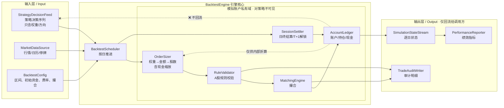
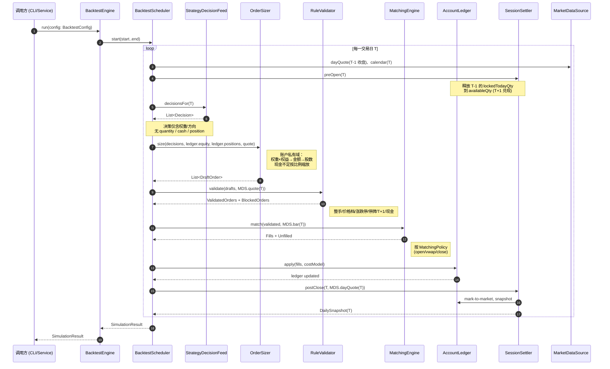
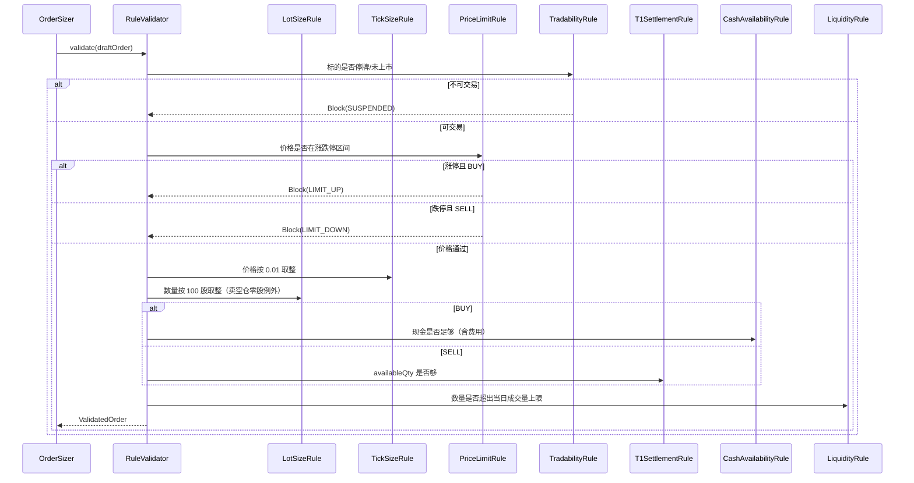
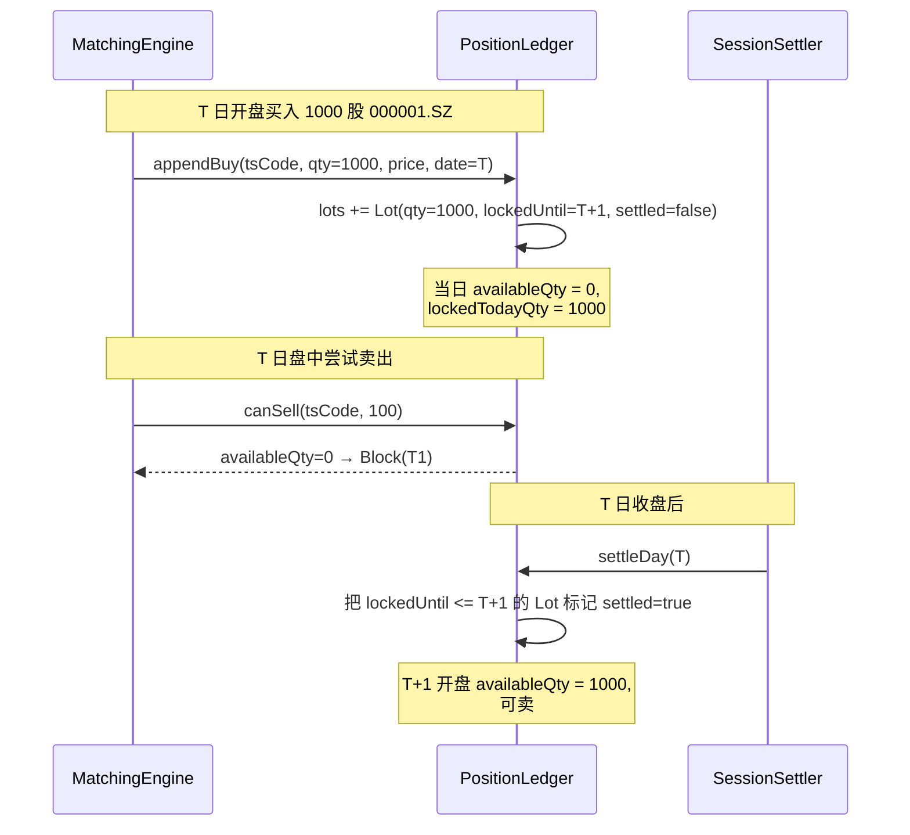

# 回测引擎设计文档（A 股规则版）

> 本文档定义 `backtest` 模块的职责边界、领域模型、组件协作与关键流程。
> 范围：在 A 股交易约束下，以**策略输出**（某日某只股票的目标仓位 / 买卖信号）为输入，进行**模拟交易执行**，给出可审计、可复盘的回测结果。
> 非范围：策略本身（选股、情绪、买卖点、仓位分析），这些归 `strategy-server` 负责；本模块**不重新打分**、**不重新选股**。

---

## 1. 设计目标与边界

### 1.1 核心定位

回测引擎是一个**纯执行层**，并且**内化模拟账户**——账户的现金、持仓、可卖数量、权益曲线全部由回测内部维护，**对策略不可见**：

```
策略输出（决策，仅含权重/方向） → [回测引擎：内含模拟账户] → 模拟成交 + 绩效报告
```

它接收策略每一交易日的「**意图**」，按 A 股交易规则进行真实可信的**模拟撮合**，最终输出**可与实盘对齐的执行结果**。

### 1.2 输入契约（关键边界：策略零账户感知）

**策略的输出是「市场观点」，不是「下单指令」。** 策略不知道、也不应该知道：

- 当前账户有多少现金
- 当前持有哪些股票、各多少股
- T+1 锁仓状态
- 上次有没有成交、是否被规则拦截

策略每个交易日 `T` 只产出以下两类内容之一（或组合）：

1. **目标组合** `TargetPortfolioDecision`：T+1 想要持有的组合，**只用权重表达**（`Map<tsCode, weight>`，每只权重 0~1，全部加起来 ≤ `sentimentExposure`）。
2. **显式交易方向** `TradeIntentDecision`：T+1 对某只股票的方向性意图（`BUY` / `SELL` / `HOLD`），**只带权重或方向，不带股数**。

权重 → 股数的折算**完全发生在回测引擎内部**：用回测自己持有的「账户总权益（mark-to-market）」乘以权重得到目标金额，再按当日 RAW 价折算成股数，按 100 股取整。

> 兼容现有 `TargetPosition`、`StrategyPositionSnapshot`：适配层 `StrategyDecisionFeed` 把策略产出映射到上述两类决策，**剥离掉任何账户相关字段**。

### 1.3 输出契约

```
SimulationResult
  ├── orders          各日委托与成交明细
  ├── positions       逐日持仓快照（含 T+1 可卖锁定）
  ├── cashFlows       现金变动序列
  ├── equityCurve     权益曲线（按日 mark-to-market）
  ├── tradeAudit      每笔交易的原因、滑点、阻断原因、缩放原因
  └── metrics         绩效指标（收益、回撤、夏普、胜率…）
```

输出**只回流给调用方**（CLI / 报表服务），**不回流给策略**。即使策略在同一进程内运行，回测也不会把账户状态作为参数传回策略层。

### 1.4 边界明确

| 类型 | 由谁负责 | 是否对策略可见 |
| --- | --- | --- |
| 选股 / 评分 / 因子 | `strategy-server` | — |
| 情绪仓位 / 总暴露上限 | `strategy-server` | — |
| 买卖点触发条件 | `strategy-server`（写入 `TradeIntent.executionHint`） | — |
| **目标权重 → 目标金额** | **`backtest`** | ❌ 不可见 |
| **目标金额 → 目标股数（含整手）** | **`backtest`** | ❌ 不可见 |
| **整手 / T+1 / 涨跌停 / 价格档** | **`backtest`** | ❌ 不可见 |
| **撮合 / 成交价模拟 / 滑点** | **`backtest`** | ❌ 不可见 |
| **账户、持仓、可卖数量、现金** | **`backtest` 内化** | ❌ 不可见 |
| **现金不足时的订单缩放** | **`backtest`** | ❌ 不可见 |
| **绩效与归因** | **`backtest`** | ❌ 不可见 |
| 实盘下单 | 不在范围内 | — |

### 1.5 为什么要彻底解耦账户与策略

1. **策略可复现**：同一策略在不同初始资金、不同账户起始状态下，应该输出**完全相同的权重序列**。如果策略感知到账户状态，就会变成「策略 × 账户」的笛卡尔积，无法独立评估 alpha。
2. **回测 ↔ 实盘对齐**：将来接实盘时，券商账户接口替换 `AccountLedger`，策略侧零改动。
3. **避免反馈循环**：策略一旦看到账户余额，就会出现"现金不够所以下次别选这只"之类的隐性反馈逻辑，破坏策略本身的可解释性。
4. **配置灵活**：同一策略可以同时跑 100 万 / 1000 万 / 1 亿三档回测，账户由配置决定，策略代码不变。

---

## 2. A 股交易规则建模

> 这里只列回测引擎需要建模的规则。每条规则会落到代码中一个具体策略类（`MarketRule` 子类），保证可单测、可替换。

### 2.1 时间维度

| 规则 | 实现位置 |
| --- | --- |
| 仅在交易日撮合（节假日、周末跳过） | `TradingCalendar` |
| 一天内分阶段：集合竞价（09:15-09:25）、连续竞价（09:30-11:30 / 13:00-14:57）、收盘竞价（14:57-15:00） | `TradingSession` 枚举 |
| 日线级回测默认按 `OPEN / CLOSE` 两个撮合点驱动 | `MatchingPolicy` |
| 分钟级回测可扩展为按 K 线步进 | `MatchingPolicy` |

### 2.2 报单数量

| 规则 | 实现 |
| --- | --- |
| 买入数量必须为 **100 股整数倍**，下取整 | `LotSizeRule` |
| 卖出可以一次性卖出**不足 100 股的零股余额**（持仓 < 100 必须一次性清掉） | `LotSizeRule` |
| 买入数量 = `min(权重金额, 风险金额, 可用现金, 流动性上限) / 价格`，再按 100 股取整 | `OrderSizer` |

### 2.3 价格维度

| 规则 | 实现 |
| --- | --- |
| 最小价格变动 **0.01 元**，所有委托价向下/向上对齐到分 | `TickSizeRule` |
| 主板涨跌幅 **±10%**（含 ST 板块按当日生效规则；2026 年起 ST 也按 10%） | `PriceLimitRule` |
| 涨跌停价基于**前收价**计算，四舍五入到 0.01，遵循交易所口径 | `PriceLimitRule.calcLimits()` |
| 创业板 / 科创板 / 北交所 ±20%（默认股票池不含，但规则可配置） | `PriceLimitRule` |
| 新股前 5 个交易日不设涨跌幅（默认排除，可开关） | `PriceLimitRule` |

### 2.4 可交易性

| 规则 | 实现 |
| --- | --- |
| 停牌当日不能买入也不能卖出 | `TradabilityRule` |
| 涨停封死无成交假设 → 买单 `BLOCKED_LIMIT_UP` | `TradabilityRule` |
| 跌停封死无成交假设 → 卖单 `BLOCKED_LIMIT_DOWN` | `TradabilityRule` |
| 退市整理期、风险警示状态：可选过滤 | `TradabilityRule` |
| 成交量为 0 或 < 报单数量：买单按可成交整手数量截断；清仓卖单若不足以全清，则按 1 买 1 卖语义阻断 | `LiquidityRule` |

### 2.5 T+1 规则（核心）

> A 股最具特征的规则。账户内部必须区分 **可用持仓** 和 **冻结持仓**。

```
持仓 Lot 模型：
  - availableQty  ：T 日之前已结算，T 日可卖
  - lockedTodayQty：T 日新买入，T+1 才能卖出
```

| 规则 | 实现 |
| --- | --- |
| 当日买入的股票，当日不可卖 | `T1SettlementRule` |
| 收盘结算时 `lockedTodayQty → availableQty` | `T1SettlementRule.settle()` |
| 卖出数量必须 ≤ `availableQty` | `OrderValidator` |
| 同一标的**最多只存在一个 Lot**（见 §2.6） | `PositionLedger` |

### 2.6 单笔交易规则（1 买 1 卖语义）

> 业务约束：**同一标的在一个未平仓生命周期里，只允许 1 次买入、1 次完整卖出，不允许加仓、不允许分批卖出。**
> 这条规则简化了仓位管理、成本核算与归因，强制策略每一笔交易都是一次完整的「建仓 → 清仓」决策。

| 规则 | 实现 | 说明 |
| --- | --- | --- |
| 同一标的同时只能存在 **一个 Lot** | `PositionLedger` | Lot 内 quantity 是这一轮的全部持仓 |
| **持有期间禁止加仓** | `OrderSizer` → `BlockReason.ALREADY_HOLDING` | 即便策略给出更高的 targetWeight，只要 `currentQty > 0` 就忽略，不下买单 |
| **持有期间禁止部分卖出** | `OrderSizer` → 卖出意图必须是「清仓」 | 任何 SELL / 权重=0 一律产出 `quantity = totalQty` 的全清单 |
| **持仓权重变化志忘** | `OrderSizer` | 同一标的 `targetWeight` 从 0.2 改成 0.3、再改回 0.15，全程视为 HOLD；只有跨过 0 才触发交易 |
| **清仓后允许重新建仓** | `PositionLedger` | T 日清仓后，T+1 起若策略再次选中该标的且账户资金足够，可触发新一轮建仓（**新 Lot 仍受 T+1 约束**） |
| **当日不允许先卖后买同一标的** | `OrderSizer` | 实务里"先卖后买"会消耗资金 T+0 但再次买入会形成新的 T+1 锁仓，会让"1 买 1 卖"语义失效；同一交易日内对同标的禁止反向操作 |

形式化伪代码：

```
foreach 决策 d:
  currentQty = ledger.qty(d.tsCode)
  case (currentQty, d.targetWeight):
    (= 0, > 0)   → 触发 BUY（首次建仓）
    (> 0, > 0)   → HOLD，忽略权重变化（即使权重变了）
    (> 0, = 0)   → 触发 SELL（一次性清仓）
    (= 0, = 0)   → 无操作
  且：当日同一 tsCode 不允许 BUY 与 SELL 同时出现
```

### 2.7 资金

| 规则 | 实现 |
| --- | --- |
| 买入：冻结现金 = 委托金额 + 预估手续费 | `CashLedger` |
| 卖出：成交回款 T 日可用（A 股资金 T+0 实际可用），但**不能买回当日**视配置开关 | `CashLedger`（默认资金 T+0 可用） |
| 不允许透支（不允许融资） | `OrderValidator` |

### 2.8 费用模型

```
买入费用 = 佣金 + 过户费
卖出费用 = 佣金 + 过户费 + 印花税(0.05%, 单向卖出)
佣金   = max(成交额 × commissionRate, minCommission)  // 默认 万分之2.5，最低 5 元
过户费 = 成交额 × transferFeeRate                      // 默认 0.001%（沪深统一调整后）
印花税 = 卖出成交额 × stampDutyRate                     // 默认 0.05%
```

均封装在 `CostModel`，参数可配置，留出后续调整接口。

### 2.9 撮合价格模型

回测的**撮合价**取决于：

| 回测频率 | 默认成交价 |
| --- | --- |
| 日线 | 次日 `OPEN`（信号 T 日生成 → T+1 开盘成交），可配置为 VWAP / CLOSE |
| 日线高保真 | T+1 `OPEN ± slippageBps`，并校验涨跌停 |
| 分钟线 | 按报单时间段的下一根 K 线开盘价（或加滑点） |

撮合策略统一抽象为 `MatchingPolicy`，允许后续拓展（如成交量加权、订单簿模拟）。

### 2.10 复权与价格口径

- 信号口径：策略侧默认 `HFQ`（避免历史除权扭曲信号）。
- 执行口径：撮合**必须使用 `RAW` 原始价**（实盘按真实价格交易），费用、涨跌停、价格档都基于 RAW。
- 权益核算：账户净值统一按 `RAW × 持仓数量` 计算；遇到分红/送股/拆股，通过 `CorporateActionApplier` 调整持仓数量与现金。

---

## 3. 架构概览

### 3.1 模块依赖

```
backtest（新增）
  ├── 依赖：shared（Candle/PriceBasis/StrategyPositionSnapshot 等领域模型）
  ├── 依赖：database（行情读取、日历、停牌、股票基础信息）
  └── 依赖：strategy-server:contract（StrategyDecision 适配）
```

### 3.2 架构图

> 关键边界：虚线框内的「**模拟账户私有域**」对策略完全不可见。策略只产出权重 / 方向，所有「权重 → 金额 → 股数」「现金校验 / 缩放」「T+1 锁仓」都发生在私有域内。



### 3.3 子模块职责

| 子模块 | 职责 |
| --- | --- |
| `BacktestEngine` | 顶层门面，组装组件、驱动主循环 |
| `BacktestScheduler` | 按交易日推进；管理「开盘 / 盘中 / 收盘」三阶段事件 |
| `StrategyDecisionFeed` | 把策略输出（TargetPortfolio / TradeIntent）映射为回测内部 `Decision`；**只允许带权重 / 方向，丢弃任何账户字段** |
| `OrderSizer` | **账户私有域**：把策略给的权重对照当前账户权益、可用现金、当日 RAW 价折算成股数；含「整手取整」「现金不足按比例缩放」「权重负 → 平仓」三种基本规则 |
| `RuleValidator` | 串联 A 股规则链（整手、价格档、涨跌停、停牌、T+1、现金）；产出 `ValidatedOrder` 或 `BlockedOrder` |
| `MatchingEngine` | 按 `MatchingPolicy` 撮合，生成 `Fill` |
| `CostModel` | 计算佣金、过户费、印花税 |
| `AccountLedger` | **私有域**：现金账户 + 持仓账户（PositionLedger）双账；唯一公开接口是「快照导出（给输出层）」和「权益估值（给 OrderSizer）」 |
| `PositionLedger` | 以单 Lot 维护同一标的完整建仓生命周期；买入后锁仓，次日释放可卖；卖出必须全清 |
| `SessionSettler` | 盘前执行 T+1 解锁；收盘 mark-to-market、生成日终快照，并触发公司行动处理入口 |
| `CorporateActionApplier` | 处理现金分红、送股、拆股引起的现金、持仓数量与成本调整 |
| `MarketDataSource` / `BacktestMarketDataFeed` | 统一行情访问入口（K 线、停牌、新股、ST 状态）；DB 实现读取 `stock_daily_data` RAW 日线事实 |
| `TradingCalendar` | 交易日历查询与推进 |
| `SimulationResult` | 聚合最终回测产物 |
| `PerformanceReporter` | 计算收益、夏普、最大回撤、胜率、换手率、单票贡献 |
| `TradeAuditWriter` | 落审计记录（可写入 DB / 文件 / 内存） |

### 3.4 数据流（一个交易日）

```
T 日开盘前
  · SessionSettler.preOpen(T)：刷新昨日持仓的 availableQty
  · StrategyDecisionFeed.readDecisions(T) → List<Decision>   // 仅含权重/方向
T 日开盘撮合（全部发生在账户私有域）
  · OrderSizer.size(decisions, ledger.equity, ledger.positions, quote)
        ├─ 权重 × 总权益 → 目标金额
        ├─ 目标金额 / RAW价 → 目标股数
        ├─ 与当前持仓做 diff → 买入数量 / 卖出数量
        ├─ 按 100 股取整（卖出零股例外）
        └─ 若 Σ 买入金额 + 预估费用 > 可用现金：按比例缩放，audit 记 "CASH_SCALED"
        → List<DraftOrder>
  · RuleValidator.validate(orders, market) → List<ValidatedOrder> + List<BlockedOrder>
  · MatchingEngine.match(validated, opening quotes) → List<Fill>
  · AccountLedger.apply(fills, costs)
T 日盘中（可选，分钟级或盘中信号）
  · 同上，但走 intraday 撮合策略
T 日收盘
  · MarketDataSource.dayQuote(T) → 用收盘价 mark-to-market
  · SessionSettler.postClose(T)：
      - 锁仓 lockedTodayQty 标记为 settled（次日变为 availableQty）
      - 写 equityCurve[T]
      - 写 positions 快照
      - CorporateActionApplier.apply(T) 处理该交易日收盘后的分红/拆股等公司行动

⚠️ 全过程账户状态只在私有域内流动；StrategyDecisionFeed 上游（策略）看不到任何 ledger.* 字段。
```

---

## 4. 时序图

### 4.1 单日完整流程



### 4.2 订单合规校验链



### 4.3 T+1 锁仓时序



---

## 5. 类图

### 5.1 领域模型核心类图

```mermaid
classDiagram
    %% ===== 配置 =====
    class BacktestConfig {
        +LocalDate startDate
        +LocalDate endDate
        +Money initialCapital
        +Universe universe
        +CostModelConfig costs
        +MatchingPolicy matching
        +SlippageModel slippage
        +PriceBasis signalBasis
        +PriceBasis executionBasis
        +Boolean allowIntradaySellOnDayBuy  // false=严格 T+1
    }

    %% ===== 输入：策略决策（策略零账户感知）=====
    class StrategyDecision {
        <<sealed>>
        +LocalDate effectiveDate
        +String reason
    }
    class TargetPortfolioDecision {
        +Map~String, Double~ targetWeights
        +Double sentimentExposure
    }
    class TradeIntentDecision {
        +String tsCode
        +Side side
        +Double? weight
        +ExecutionHint hint
    }
    note for StrategyDecision "不含任何账户字段：\n无 quantity / cash / position\n仅含市场观点（权重 / 方向）"
    StrategyDecision <|-- TargetPortfolioDecision
    StrategyDecision <|-- TradeIntentDecision

    class Side {
        <<enum>>
        BUY
        SELL
    }
    class ExecutionHint {
        <<enum>>
        OPEN
        VWAP
        CLOSE
        LIMIT
    }

    %% ===== 订单 =====
    class DraftOrder {
        +String tsCode
        +Side side
        +Long quantity
        +Double? limitPrice
        +ExecutionHint hint
        +String reason
    }
    class ValidatedOrder {
        +String tsCode
        +Side side
        +Long quantity
        +Double limitPrice
        +ExecutionHint hint
    }
    class BlockedOrder {
        +DraftOrder source
        +BlockReason reason
        +String detail
    }
    class BlockReason {
        <<enum>>
        SUSPENDED
        LIMIT_UP_BUY
        LIMIT_DOWN_SELL
        INSUFFICIENT_CASH
        INSUFFICIENT_QUANTITY_T1
        BELOW_LOT_SIZE
        LIQUIDITY_EXHAUSTED
        DELISTED
        IPO_FROZEN
        ALREADY_HOLDING
        SAME_DAY_REVERSE
    }
    DraftOrder ..> Side
    ValidatedOrder ..> Side
    BlockedOrder *-- DraftOrder
    BlockedOrder ..> BlockReason

    %% ===== 撮合 =====
    class Fill {
        +String orderId
        +String tsCode
        +Side side
        +Long quantity
        +Double price
        +Money commission
        +Money transferFee
        +Money stampDuty
        +LocalDateTime filledAt
    }

    %% ===== 账户与持仓 =====
    class AccountLedger {
        +Money cash
        +PositionLedger positions
        +apply(fills) Unit
        +equity(quote) Money
    }
    class PositionLedger {
        +Map~String, StockPosition~ holdings
        +availableQty(tsCode) Long
        +lockedTodayQty(tsCode) Long
        +avgCost(tsCode) Double
        +applyBuy(fill) Unit
        +applySell(fill) Unit
        +settleDay(date) Unit
    }
    class StockPosition {
        +String tsCode
        +Lot? lot
        +Long totalQty()
        +Long availableQty()
        +Long lockedTodayQty()
    }
    note for StockPosition "1 买 1 卖语义：\nlot 要么不存在（无持仓）\n要么唯一存在（持仓中）\n禁止加仓 / 禁止分批卖出"
    class Lot {
        +LocalDate buyDate
        +Long quantity
        +Double cost
        +Boolean settled  // true=已过 T+1
    }
    AccountLedger *-- PositionLedger
    PositionLedger *-- StockPosition
    StockPosition o-- Lot

    %% ===== 规则 =====
    class RuleValidator {
        +validate(order, ctx) ValidatedOrder | BlockedOrder
    }
    class MarketRule {
        <<interface>>
        +apply(order, ctx) RuleOutcome
    }
    class LotSizeRule
    class TickSizeRule
    class PriceLimitRule
    class TradabilityRule
    class T1SettlementRule
    class CashAvailabilityRule
    class LiquidityRule
    MarketRule <|.. LotSizeRule
    MarketRule <|.. TickSizeRule
    MarketRule <|.. PriceLimitRule
    MarketRule <|.. TradabilityRule
    MarketRule <|.. T1SettlementRule
    MarketRule <|.. CashAvailabilityRule
    MarketRule <|.. LiquidityRule
    RuleValidator o-- MarketRule

    %% ===== 撮合策略 =====
    class MatchingEngine {
        +match(orders, bars) List~Fill~
    }
    class MatchingPolicy {
        <<interface>>
        +matchPrice(order, bar, slippage) Double
    }
    class OpenPriceMatching
    class ClosePriceMatching
    class VwapMatching
    class LimitOrderMatching
    MatchingPolicy <|.. OpenPriceMatching
    MatchingPolicy <|.. ClosePriceMatching
    MatchingPolicy <|.. VwapMatching
    MatchingPolicy <|.. LimitOrderMatching
    MatchingEngine o-- MatchingPolicy

    %% ===== 费用 =====
    class CostModel {
        +commission(amount) Money
        +transferFee(amount) Money
        +stampDuty(amount, side) Money
    }

    %% ===== 行情 / 日历 =====
    class MarketDataSource {
        <<interface>>
        +bar(tsCode, date) Candle?
        +preClose(tsCode, date) Double?
        +isSuspended(tsCode, date) Boolean
        +listStatus(tsCode, date) ListStatus
        +isNewlyListedWithinDays(tsCode, date, n) Boolean
    }
    class TradingCalendar {
        +isOpen(date) Boolean
        +nextTradingDay(date) LocalDate
        +tradingDaysBetween(start, end) List~LocalDate~
    }

    %% ===== 引擎 =====
    class BacktestEngine {
        +run(config) SimulationResult
    }
    class BacktestScheduler {
        +runLoop() Unit
    }
    class StrategyDecisionFeed {
        +decisionsFor(date) List~StrategyDecision~
    }
    class OrderSizer {
        +size(decisions, ledger, quote) List~DraftOrder~
    }
    note for OrderSizer "账户私有域：\n权重 × 权益 → 金额 → 股数\n现金不足时按比例缩放\n并写 audit(CASH_SCALED)"
    class SessionSettler {
        +preOpen(date) Unit
        +postClose(date) Unit
    }

    BacktestEngine *-- BacktestScheduler
    BacktestScheduler o-- StrategyDecisionFeed
    BacktestScheduler o-- OrderSizer
    OrderSizer ..> AccountLedger : 仅读权益/持仓
    BacktestScheduler o-- RuleValidator
    BacktestScheduler o-- MatchingEngine
    BacktestScheduler o-- AccountLedger
    BacktestScheduler o-- SessionSettler
    BacktestScheduler o-- MarketDataSource
    BacktestScheduler o-- TradingCalendar
    MatchingEngine ..> CostModel

    %% ===== 输出 =====
    class SimulationResult {
        +List~OrderRecord~ orders
        +List~DailyPositionSnapshot~ positions
        +List~CashFlow~ cashFlows
        +List~EquityPoint~ equityCurve
        +List~TradeAudit~ audits
        +PerformanceMetrics metrics
    }
    class PerformanceMetrics {
        +Double totalReturn
        +Double annualizedReturn
        +Double maxDrawdown
        +Double sharpe
        +Double sortino
        +Double winRate
        +Double turnover
        +Double avgHoldingDays
    }
    BacktestEngine ..> SimulationResult
    SimulationResult *-- PerformanceMetrics
```



### 5.2 关键类详注（伪 Kotlin 代码）

> 仅用于设计阶段读对齐，正式实现时按 KMP 模块规范分包。所有注释为中文，便于团队沟通。

```kotlin
package org.shiroumi.backtest.engine

import kotlinx.datetime.LocalDate
import model.PriceBasis

/**
 * 回测引擎入口。负责装配子组件并启动 [BacktestScheduler] 主循环。
 *
 * 输入：[BacktestConfig]——回测区间、初始资金、费率、撮合策略、复权口径。
 * 输出：[SimulationResult]——逐日成交、持仓、权益曲线及绩效指标。
 *
 * 该类**不包含任何交易决策**，仅负责把策略输出转化为合法的模拟成交。
 */
class BacktestEngine(
    private val decisionFeed: StrategyDecisionFeed, // 策略决策序列：每日策略想做什么（仅权重/方向）
    private val orderSizer: OrderSizer,             // 账户私有域：权重→金额→股数 + 现金缩放
    private val marketData: MarketDataSource,       // 行情数据：K线、停牌、状态
    private val calendar: TradingCalendar,          // 交易日历：跳过节假日
    private val ruleValidator: RuleValidator,       // A 股规则校验链
    private val matchingEngine: MatchingEngine,     // 撮合
    private val ledger: AccountLedger,              // 账户与持仓双账（私有，对策略不可见）
    private val settler: SessionSettler,            // 结算器，处理 T+1 解锁
    private val reporter: PerformanceReporter,      // 绩效报告生成
) {
    fun run(config: BacktestConfig): SimulationResult { /* ... */ TODO() }
}

/**
 * 调度器：把回测区间拆成交易日序列，按「盘前→开盘撮合→盘中→收盘→结算」推进。
 *
 * 子类化点：日线 vs 分钟线（默认 DailyScheduler）。
 */
class BacktestScheduler(/* deps */) {
    /** 主循环：按 [TradingCalendar] 推进交易日并触发各阶段。 */
    fun runLoop(start: LocalDate, end: LocalDate) { /* ... */ }
}

/**
 * 把外部策略输出统一映射为回测可消费的 [StrategyDecision] 序列。
 *
 * 适配范围：
 *  - 历史 daily_target_portfolio （TargetPortfolioDecision）
 *  - 历史 daily_strategy_audit + intraday 信号（TradeIntentDecision）
 *  - 外部回放 JSON / CSV
 *
 * **强制约束**：返回的 [StrategyDecision] 不允许包含任何账户字段
 * （quantity、cashAmount、currentPosition、availableCash 等）。
 * 适配器在转换过程中需主动过滤掉这类字段，确保策略零账户感知。
 */
interface StrategyDecisionFeed {
    /** 返回某交易日策略想要做的决策；可能同时含 TargetPortfolio + 显式信号。 */
    fun decisionsFor(date: LocalDate): List<StrategyDecision>
}

/**
 * 决策 → 草稿订单。**位于账户私有域**，是策略边界的唯一翻译层。
 *
 * 输入：策略给的权重 / 方向（无金额、无股数）
 * 输出：含 RAW 价、整手股数、合规缩放后的 [DraftOrder]
 *
 * 折算流程（**严格遵守 1 买 1 卖语义**）：
 *  1. 对每个决策按 (currentQty, targetWeight) 二维状态机判定：
 *      (= 0,  > 0)  → 触发 BUY：金额 = ledger.equity × weight，按 100 股取整
 *      (> 0,  > 0)  → HOLD：忽略权重变化（即便从 0.2 变为 0.3 也不加仓）
 *      (> 0,  = 0)  → 触发 SELL：quantity = totalQty（一次性清仓，零股一并卖出）
 *      (= 0,  = 0)  → 无操作
 *  2. 同一交易日同一 tsCode 不允许同时出现 BUY 与 SELL（[BlockReason.SAME_DAY_REVERSE]）。
 *  3. 全部买单汇总后做现金校验：
 *      预估买入金额（含费用） ≤ ledger.availableCash：直接通过
 *      超出：按比例缩放所有买单的股数（再次按 100 股取整）
 *            audit 写入 reason="CASH_SCALED", scaleRatio=...
 *  4. 此阶段不做涨跌停 / 停牌 / T+1 检查，那是 [RuleValidator] 的事。
 *
 * 设计原则：本类**只读** [AccountLedger]，不修改账户；账户变更必须经 [MatchingEngine] → [AccountLedger.apply]。
 */
class OrderSizer(/* deps */) {
    fun size(
        decisions: List<StrategyDecision>,
        ledger: AccountLedger,
        ctx: MatchingContext,
    ): List<DraftOrder> { TODO() }
}

/**
 * 规则校验链。顺序执行 [MarketRule] 列表，遇到第一个 Block 即短路返回。
 *
 * 默认链：
 *  TradabilityRule → PriceLimitRule → TickSizeRule → LotSizeRule
 *    → T1SettlementRule（仅 SELL）→ CashAvailabilityRule（仅 BUY）→ LiquidityRule
 */
class RuleValidator(private val rules: List<MarketRule>) {
    fun validate(order: DraftOrder, ctx: MatchingContext): RuleOutcome { TODO() }
}

/**
 * A 股交易规则接口。
 *
 * 每条规则都是**纯函数**，给定订单 + 上下文，返回通过 / 调整 / 阻断。
 * 这样既可单测，也方便后续根据交易所规则演进（如 2026 主板 ST 涨跌幅调整）。
 */
fun interface MarketRule {
    fun apply(order: DraftOrder, ctx: MatchingContext): RuleOutcome
}

sealed interface RuleOutcome {
    /** 通过。可能修订订单（如价格按 0.01 取整、数量按 100 股取整）。 */
    data class Pass(val adjusted: DraftOrder) : RuleOutcome

    /** 阻断。订单不进入撮合。 */
    data class Block(val reason: BlockReason, val detail: String) : RuleOutcome
}

/**
 * 撮合引擎。
 *
 * 注意：撮合使用**原始价 RAW**，与实盘对齐；
 * 策略口径如果是 HFQ/QFQ，仅用于信号生成阶段。
 */
class MatchingEngine(
    private val policy: MatchingPolicy,
    private val slippage: SlippageModel,
    private val costs: CostModel,
) {
    fun match(orders: List<ValidatedOrder>, ctx: MatchingContext): List<Fill> { TODO() }
}

/**
 * 撮合定价策略：决定一笔订单的成交价。
 *
 *  - OpenPriceMatching：用次日开盘价；最常见的日线回测口径。
 *  - VwapMatching      ：按当日 VWAP 模拟，更接近大资金成交。
 *  - ClosePriceMatching：用当日收盘价；常用于因子研究但偏理想。
 *  - LimitOrderMatching：按限价单逻辑：触发价被穿越才成交。
 */
interface MatchingPolicy {
    fun matchPrice(order: ValidatedOrder, bar: Candle, slippage: SlippageModel): Double?
}

/**
 * 账户总账：现金 + 持仓 + mark-to-market 权益。
 *
 * 所有的资金、持仓变更必须通过 [apply]，禁止外部直接改字段。
 */
class AccountLedger(initialCash: Money) {
    var cash: Money = initialCash
        private set
    val positions: PositionLedger = PositionLedger()

    fun apply(fills: List<Fill>) { /* ... */ }
    fun equity(quote: Map<String, Double>): Money { /* ... */ TODO() }
}

/**
 * 持仓总账：以单一 [Lot] 为单位维护，区分可用 / 锁仓。
 *
 * **核心约束（1 买 1 卖语义）**：同一 tsCode **同时只能存在一个 Lot**。
 *  - 已持仓时再调用 [applyBuy] 会抛 IllegalStateException（由 OrderSizer 在更上游阻断）
 *  - [applySell] 必须把 Lot 一次性清空，不接受部分卖出（quantity != totalQty 抛错）
 *  - 清仓后 lot 置空，下一交易日可再次建仓（仍受 T+1 约束）
 *
 * A 股 T+1 规则实现：
 *  - 买入：创建唯一 Lot，settled=false。
 *  - 卖出：要求 settled=true；卖出后 lot=null。
 *  - 收盘结算：把 buyDate < 当日 的 Lot 标记 settled=true。
 */
class PositionLedger {
    fun availableQty(tsCode: String): Long { TODO() }
    fun lockedTodayQty(tsCode: String): Long { TODO() }
    fun applyBuy(fill: Fill) {
        // 1 买 1 卖：已有 lot 直接抛错（防御性，正常情况下 OrderSizer 已拦截）
        // lot = Lot(buyDate=fill.date, qty=fill.qty, cost=fill.price, settled=false)
    }
    fun applySell(fill: Fill) {
        // 必须等于 lot.quantity；零股余额一并清掉；清掉后 lot = null
    }
    fun settleDay(date: LocalDate) { /* 把 buyDate < date 的 Lot 标 settled */ }
}

/**
 * 日终结算器。负责：
 *  1. 开盘前：把昨日买入的 Lot 标 settled，更新 availableQty。
 *  2. 收盘后：mark-to-market、生成快照、应用次日除权除息。
 */
class SessionSettler(/* deps */) {
    fun preOpen(date: LocalDate) { /* PositionLedger.settleDay(date - 1d) */ }
    fun postClose(date: LocalDate) { /* snapshot, dividend, split */ }
}
```

---

## 6. 关键流程示例（手把手过一遍）

### 6.1 例 1：T 日盘后策略给出 T+1 目标组合

```
T 日 18:00（盘后）：策略产出
  TargetPortfolio(effective=T+1, weights = {
    "000001.SZ": 0.2,
    "600519.SH": 0.2,
    "300750.SZ": 0.2,
    "002594.SZ": 0.2,
    "601318.SH": 0.2,
  }, sentimentExposure=1.0)

T+1 开盘前：
  · Scheduler.preOpen(T+1)：PositionLedger.settleDay(T)
  · DecisionFeed.decisionsFor(T+1) → [TargetPortfolioDecision(...)]
    注意：策略此处只给了 weights = {...}，并不知道账户有 100 万还是 1000 万。

T+1 开盘撮合（账户私有域）：
  · OrderSizer.size：
      → 读 ledger.equity = 1_000_000（mark-to-market）
      → 当前持仓 = []
      → 5 只各 20%，单票目标金额 = 1_000_000 × 0.20 = 200_000
      → 000001.SZ 开盘价 RAW = 11.50 → 200_000 / 11.50 ≈ 17_391
      → 100 股取整 → 17_300 股，金额 198_950
      → 现金校验：5 笔合计 ~995_000 + 费用 ~250 < 可用现金 1_000_000，通过
      → 输出 5 笔 DraftOrder

  · RuleValidator：
      ✓ 不停牌
      ✓ 开盘价不在涨停（前收×1.1）
      ✓ 11.50 已是 0.01 单位
      ✓ 17_300 是 100 倍数
      ✓ 现金足够
      → ValidatedOrder x5

  · MatchingEngine（policy=OpenPriceMatching）：
      Fill: 000001.SZ x17300 @ 11.50, commission=49.74, transferFee=1.99, stampDuty=0
      （以此类推）

  · AccountLedger：
      cash -= 5 笔成交额 + 费用
      positions: 5 只各创建唯一 Lot(buyDate=T+1, settled=false)
      （遵守 1 买 1 卖：每只股票只有 1 个 Lot；后续即便策略给更高权重也不会加仓）

T+1 收盘：
  · 任意一只跌停？没有 → mark-to-market
  · equityCurve[T+1] = cash + Σ qty × close
  · SessionSettler 不立刻 settle（要等下一天 preOpen）
```

### 6.2 例 2：买入当日不可卖

```
T 日开盘买入 000001.SZ x1000 → Lot(buyDate=T, settled=false)
T 日盘中策略改主意，给 TradeIntent(SELL, 000001.SZ, 1000)

OrderSizer → DraftOrder(SELL, 1000)
RuleValidator → T1SettlementRule：
   availableQty(000001.SZ) = 0  // settled=false 不计入可用
   → Block(INSUFFICIENT_QUANTITY_T1)

记入 BlockedOrder + TradeAudit(原因="当日买入不可卖")
T+1 开盘前 preOpen 才会把这笔 Lot 设为 settled，availableQty 变为 1000
```

### 6.3 例 3：开盘一字涨停

```
T 日盘后：候选股 002594.SZ 进入目标组合
T+1 开盘：002594.SZ 开盘价 = 前收 × 1.10（一字涨停）
RuleValidator → PriceLimitRule：BUY 价格 == 涨停价 且 量极小 → Block(LIMIT_UP_BUY)
TradeAudit 记录："WAIT_LIMIT_UP_OR_SUSPENDED"
Engine 继续推进，002594.SZ 未持仓，目标权重视为 0（现金留存）
（可配置策略：是否当日多次重试 / 等待回落）
```

### 6.4 例 4：1 买 1 卖语义 —— 权重变化志忘 + 重新建仓

```
背景：账户已持有 000001.SZ x10000（一个未平 Lot），持仓市值约 115_000。

Day T：策略输出权重 0.30（之前是 0.20）
  · OrderSizer：currentQty>0 且 targetWeight>0 → HOLD
  · 既不下买单（禁止加仓），也不下卖单（禁止部分调仓）
  · 不会写 audit，因为不是"事件"，是稳态

Day T+1：策略输出权重 0.10（继续降）
  · 同上 → HOLD

Day T+2：策略输出权重 0.0（剔除该票）
  · OrderSizer：currentQty>0 且 targetWeight=0 → 触发 SELL
  · quantity = totalQty = 10_000（一次性清仓，无零股）
  · RuleValidator → 价格档/T+1（已 settled）/涨跌停均通过
  · MatchingEngine → Fill 卖出 10_000 @ open，lot=null

Day T+3：策略又把 000001.SZ 权重设为 0.20
  · 此时 currentQty=0 且 targetWeight>0 → 触发 BUY（新一轮生命周期）
  · 新建 Lot(buyDate=T+3, settled=false)，受 T+1 锁仓约束
  · 这是允许的：清仓后**次日及以后**可重新建仓

关键不变量：整个过程中 PositionLedger 里 000001.SZ 的 lot 数量最多为 1。
```

### 6.5 例 5：现金不足按比例缩放（策略零感知）

```
账户当前：cash = 300_000, positions = 持有 600519.SH 价值 100_000，equity = 400_000
策略输出：TargetPortfolioDecision(weights = {
  "000001.SZ": 0.5,
  "300750.SZ": 0.5,
})
注意：策略不知道账户只有 30 万可用现金，它给的是「想要」的权重。

OrderSizer：
  · 目标金额：000001.SZ = 400_000 × 0.5 = 200_000
              300750.SZ = 400_000 × 0.5 = 200_000
  · diff（当前持仓为 0）→ 200_000 / 200_000 = 全买
  · 现金校验：买入合计 400_000 + 费用 ≈ 400_100
              可用现金只有 300_000，不够
  · 按比例缩放：ratio = 300_000 / 400_100 ≈ 0.74982
              000001.SZ 股数 × 0.74982 → 再按 100 股取整
              300750.SZ 股数 × 0.74982 → 再按 100 股取整
  · audit 写入：reason="CASH_SCALED", scaleRatio=0.74982
  · 策略对此**完全无感**，下一周期它依然按 0.5/0.5 给权重。

权益曲线、tradeAudit 都会记录这次缩放，但策略本身不接收任何账户反馈。
```

### 6.6 例 6：分红除权

```
T 日：持有 600519.SH x100，成本 1700.00
T+1 除权日：每股派息 6.92 元
CorporateActionApplier.apply(T+1)：
   现金 += 100 × 6.92 = 692
   持仓数量不变
   成本基准不变（成本=市场买入价，分红不调整成本，只影响 PnL 归因）
   行情口径切换：从 T+1 起的 RAW 价已是除权后价格
PerformanceReporter 把分红记入 cashFlows，避免计算回报时出现「凭空跳水」
```

---

## 7. 配置示例（YAML，最终格式以 `config.yaml` 为准）

```yaml
backtest:
  start_date: 2024-01-02
  end_date: 2025-12-31
  initial_capital: 1000000.00
  universe: main_board_active        # 主板存续股票（同策略层）
  signal_basis: HFQ                   # 信号口径
  execution_basis: RAW                # 撮合口径
  matching:
    policy: OPEN_PRICE                # OPEN_PRICE | VWAP | CLOSE_PRICE | LIMIT
    slippage_bps: 5                   # 5 个基点滑点
  costs:
    commission_rate: 0.00025          # 万 2.5
    min_commission: 5.00
    transfer_fee_rate: 0.00001        # 0.001%
    stamp_duty_rate: 0.0005           # 0.05%，仅卖出
  rules:
    allow_intraday_sell_on_day_buy: false   # 严格 T+1
    exclude_ipo_days: 5
    exclude_st: false
    price_limit_main_board: 0.10
    price_limit_growth_board: 0.20
  output:
    equity_curve_csv: ./out/equity_{run_id}.csv
```

---

## 8. 与现有模块的集成位置

```
strategy-server (策略层)
  ├── daily/TargetPortfolioGenerator  → 产出 TargetPosition
  ├── runtime/PostMarketStrategyRuntime → StrategyPositionSnapshot
  ↓ (适配)
backtest:engine
  ├── StrategyDecisionFeed
  │     ├── DbBackedDecisionFeed   读取 daily_target_portfolio / 审计表
  │     ├── JsonReplayDecisionFeed JSON 决策回放
  │     └── InMemoryDecisionFeed   单测 / 空输入回放
  ├── BacktestMarketDataFeed
  │     └── DatabaseBacktestMarketDataFeed 读取 stock_daily_data RAW 日线
  ├── TradingCalendar
  │     └── DbTradingCalendar      复用 CalendarTable
  ├── BacktestRunExecutor
  │     └── 组装 Scheduler、聚合结果、返回结果、可选导出 CSV
  └── PerformanceReporter / SimulationResultAggregator
        └── 输出 metrics、equityCurve、audit 明细

ktor-server
  └── BacktestRoute
        └── POST /api/backtest/run          同步执行并返回 metrics + equity 曲线

cli
  └── backtest 子命令：
        `./cli backtest --start 2024-01-02 --end 2024-12-31 --decisions audit --capital 1000000`

database / stock_db
  ├── daily_target_portfolio / daily_strategy_audit 作为策略决策输入
  ├── stock_daily_data / stock_info / calendar 作为行情与状态输入
  └── 现阶段不创建、不写入任何 backtest_* 结果表
```

---

## 9. 验证与单元测试要点

| 测试场景 | 期望 |
| --- | --- |
| 节假日跳过 | Scheduler 不调用任何成交 |
| T+1 严格执行 | 当日买入当日卖出被 Block |
| 涨停买入失败 | Block(LIMIT_UP_BUY)，账户无变化 |
| 跌停卖出失败 | Block(LIMIT_DOWN_SELL) |
| 100 股整手 | 调整后数量为 100 整数倍，下取整 |
| 零股卖出 | 持仓 < 100 时允许一次性卖出 |
| 价格档对齐 | 11.234 → 11.23（买）/ 11.24（卖）按方向取整 |
| 现金不足 | Block(INSUFFICIENT_CASH) |
| 滑点 | OPEN_PRICE policy 下 actual = open × (1 + slippage_bps × dir) |
| 佣金最低收 | 成交 1000 元 × 0.000025 = 0.025 → 实际收 5 元 |
| 印花税单边 | 买入印花税=0，卖出按 0.05% |
| 分红除权 | 现金+股息，持仓数量与权益曲线无跳变 |
| 拆股送股 | 持仓数量调整，权益不变 |
| TargetPortfolio→Order 路径 | 权重/价格折算正确，含 4 舍 5 入路径 |
| 持仓 FIFO 释放 | 多次买入按时间顺序卖出 |
| equityCurve mark-to-market | 收盘价 × 持仓 + 现金 |
| **策略零账户感知**（边界守护） | 同一策略 + 同一行情，初始资金 100 万 / 1000 万跑两遍，**策略每日产出的权重序列完全一致**（只有股数与权益曲线不同） |
| **现金不足按比例缩放** | 给一笔合计金额 > 现金的目标组合，验证 audit 出现 `CASH_SCALED` 且 scaleRatio 正确，策略下一周期权重不受影响 |
| **1 买 1 卖：禁止加仓** | 已持仓时策略给更高 targetWeight，验证不下买单且不写 audit |
| **1 买 1 卖：权重变化志忘** | 持仓期间权重 0.2 → 0.3 → 0.15 全程 HOLD；只有跨过 0 才触发交易 |
| **1 买 1 卖：清仓后次日可重建** | T 日 SELL 清仓 → T+1 起若再次入选，可触发新一轮 BUY（受 T+1 锁仓约束） |
| **1 买 1 卖：禁止当日反向** | 同日不允许同 tsCode 既 BUY 又 SELL，触发 `SAME_DAY_REVERSE` |
| **1 买 1 卖：卖出必须全清** | SELL 数量必须等于 totalQty（含零股）；任何 quantity < totalQty 的卖单视为非法 |
| **PositionLedger 单 Lot 不变量** | 任意时刻 `positions.values().forall { it.lot == null || 1 个 }`，防御性 applyBuy 在已有 lot 时抛错 |

---

## 10. 后续扩展（不在 v1 范围）

- 实盘适配器：把 `MatchingEngine` 替换为券商 API。
- 多策略并行 / 多账户组合回测。
- 盘口级（L2）撮合：成交概率、对手盘消耗。
- 融资融券、可转债、期权。
- 业绩归因：因子贡献分解（情绪/选股/择时/择股）。
- 蒙特卡洛压力测试。

---

## 11. 本地文件模式回测流程

> 本章定义回测的**离线/本地运行模式**。与 §8 中通过 Ktor HTTP API 触发的在线回测不同，本地模式不依赖 `daily_target_portfolio` / `daily_strategy_audit` 数据库表结构，而是通过文件层隔离策略中间产物的结构变化。CLI 进程通过 `config.yaml` 直连 `stock_db`，不依赖 Ktor 进程。

### 11.1 设计动机

策略在不断迭代：`daily_target_portfolio` 的列可能增减，`StrategyDecision` 的字段可能调整，`daily_strategy_audit` 的 JSON 内部格式可能演进。如果把回测直接绑在这些表结构上，每次策略 schema 变更都会导致回测编译失败或读取到不兼容的历史数据。

**解决方案**：在策略计算（写 DB）和回测执行（读决策）之间插入一层**版本化的文件桥接**。

```
策略计算（不改现有流程）                   CLI 回测（新增文件通路）
─────────────────────                   ─────────────────────────
PostMarketPreparationJob                ./cli backtest run
  ↓ 写入 DB（策略自有 schema）           ├─ ① 从 DB 导出为稳定格式文件
daily_target_portfolio ──→ 导出 ──→ .backtest/{runId}/decisions/{date}.json
daily_strategy_audit  ──→ 导出 ──→ .backtest/{runId}/decisions/{date}.json
                                         ├─ ② FileBackedDecisionFeed 读文件回测
                                         ├─ ③ 结果写入 .backtest/{runId}/output/
                                         └─ ④ 打印绩效摘要
```

**隔离边界**：
- **行情数据**（`stock_daily_data`、`stock_info`）仍直读 DB——这些是原始行情事实，结构稳定（OHLCV 是交易所标准字段）。CLI 通过 `config.yaml` 获取数据库连接参数，不经过 Ktor HTTP 层。
- **策略中间产物**（`daily_target_portfolio`、`daily_strategy_audit`）走文件桥接——这些随策略迭代频繁变化。`DecisionFileExporter` 是**唯一耦合点**：策略 schema 变更时只改它，`FileBackedDecisionFeed` 和回测引擎不受影响。

### 11.2 本地工作区结构

决策文件按**执行日**（即 `daily_target_portfolio.target_date` = T+1）命名。回测区间 `--start 2024-01-02 --end 2024-06-30` 表示在此区间的每个交易日，调度器用 `decisionsFor(T)` 获取当日要执行的目标组合，对应文件 `decisions/{T}.json`。

```
.backtest/
  bt-{timestamp}/                   ← 每次 run 创建新目录
    decisions/                      ← 回测输入：策略决策序列
      2024-01-02.json
      2024-01-03.json
      2024-01-05.json               ← 自动跳过非交易日
      ...
    output/                         ← 回测产出
      backtest_config.json          ← 回测配置快照（复盘溯源用）
      orders.jsonl                  ← 每笔订单：草稿 → 校验 → 成交/阻断
      equity_curve.jsonl            ← 逐日权益点（含回撤）
      audits.jsonl                  ← 现金缩放、阻断原因等审计
      metrics.json                  ← 绩效汇总
      summary.json                  ← CLI 打印的完整汇总（等同 stdout 输出）
      equity_curve.csv              ← 可选 CSV 导出
```

**生命周期约定**：

| 操作 | 行为 |
| --- | --- |
| `./cli backtest run` | 创建新 `bt-{timestamp}` 目录，导出决策，执行回测，写入结果 |
| `./cli backtest run --workspace .backtest/bt-xyz` | 复用已有工作区的 decisions 文件，**覆盖** output |
| `rm -rf .backtest/` | 彻底清空所有回测临时文件 |

每次 `run` 默认创建新目录，天然满足「每次重新回测清空临时文件夹」的需求。`.backtest/` 目录应在 `.gitignore` 中。

### 11.3 决策文件格式（版本化、稳定）

文件 `decisions/{executionDate}.json` 是回测引擎唯一读取的策略输入格式。它与 `daily_target_portfolio` 表结构解耦。文件内容由 `DecisionFile` 类型序列化得到，每条 `StrategyDecision` 子类通过 `@Serializable` + `@SerialName` 的多态方式嵌入。

```json
{
  "formatVersion": 1,
  "executionDate": "2024-01-02",
  "decisions": [
    {
      "type": "target-portfolio",
      "effectiveDate": "2024-01-03",
      "targetWeights": {
        "000001.SZ": 0.2,
        "600519.SH": 0.2,
        "300750.SZ": 0.2
      },
      "sentimentExposure": 0.8,
      "reason": "daily_target_portfolio targetDate=2024-01-03 rows=3"
    },
    {
      "type": "trade-intent",
      "effectiveDate": "2024-01-03",
      "tsCode": "002594.SZ",
      "side": "SELL",
      "hint": "OPEN",
      "reason": "audit: dropped from TOP_5"
    }
  ]
}
```

对应的 Kotlin 序列化包装类型：

```kotlin
@Serializable
data class DecisionFile(
    val formatVersion: Int = 1,
    val executionDate: LocalDate,
    @SerialName("decisions")
    val decisions: List<StrategyDecision>,
)
```

> 关键约定：`executionDate` 是回测执行日（T+1 开盘），等同于 `daily_target_portfolio.target_date`。`DecisionFileExporter` 按此日期查询 DB 并写入文件；`FileBackedDecisionFeed.decisionsFor(date)` 按此日期索文件。

**格式版本策略**：

- `formatVersion=1`：当前版本，`StrategyDecision` 全部字段完备（已有 `@Serializable` 注解）。
- 策略迭代改变 `daily_target_portfolio` 列时，**只改导出逻辑**（`DecisionFileExporter`），文件格式保持兼容。
- 如果文件格式确实需要升级（新增字段、改字段语义），`formatVersion` 递增，`FileBackedDecisionFeed` 根据版本号做反序列化分派。

**文件命名规则**：`{executionDate}.json`（ISO 日期格式），与 `TradingCalendar.tradingDays()` 对齐。非交易日不产生文件，`FileBackedDecisionFeed` 按执行日寻址。

### 11.4 新增组件

#### 11.4.1 `BacktestWorkspace`

管理 `.backtest/{runId}/` 目录的完整生命周期。

```kotlin
class BacktestWorkspace(val rootDir: Path) {
    val decisionsDir: Path  // rootDir/decisions/
    val outputDir: Path     // rootDir/output/
    /** 时间戳目录名，如 bt-20260525-143052 */
    val runId: String       // rootDir.fileName

    companion object {
        fun createForRun(): BacktestWorkspace  // 新建 bt-{timestamp}/
        fun open(path: Path): BacktestWorkspace // 复用已有工作区
    }
}
```

#### 11.4.2 `DecisionFileExporter`

从 `stock_db` 的策略表导出为 `decisions/{date}.json`。

```kotlin
class DecisionFileExporter(private val workspace: BacktestWorkspace) {
    suspend fun exportRange(dates: List<LocalDate>): ExportResult
}
```

**数据库依赖**：`DecisionFileExporter` 需要直连 `stock_db`。CLI 进程通过 `config.yaml`（`database.stockDb.*` 段）或环境变量 `QUANT_STOCK_DB_URL` 获取 JDBC 连接参数。这与 Ktor 进程的数据库配置复用同一份 `config.yaml`，但不经过 HTTP 层。

单日导出逻辑：优先读 `daily_target_portfolio`（`findBacktestTargetsByTargetDate`），缺失时降级读 `daily_strategy_audit`（`findBacktestSignalsByDate`，按目标日上一交易日解析），与现有 `DbBackedDecisionFeed` 的降级逻辑一致。

导出器是**唯一会随策略 schema 变更而修改的组件**。策略 `daily_target_portfolio` 列变化时，只需要更新此处的 DB 查询和映射逻辑。`DecisionFile` 格式本身保持兼容，除非 `formatVersion` 升级。

#### 11.4.3 `FileBackedDecisionFeed`

实现 `StrategyDecisionFeed`，从 `decisions/{date}.json` 反序列化决策序列。

**序列化配置要求**：`FileBackedDecisionFeed` 必须使用与 `StrategyDecision` 多态序列化兼容的 `Json` 实例：

```kotlin
private val FileDecisionJson = Json {
    ignoreUnknownKeys = true
    classDiscriminator = "type"
    serializersModule = SerializersModule {
        polymorphic(StrategyDecision::class) {
            subclass(StrategyDecision.TargetPortfolioDecision::class)
            subclass(StrategyDecision.TradeIntentDecision::class)
        }
    }
}

class FileBackedDecisionFeed(
    private val decisionsDir: Path,
    private val json: Json = FileDecisionJson,
) : StrategyDecisionFeed {
    override fun decisionsFor(date: LocalDate): List<StrategyDecision> {
        val file = decisionsDir.resolve("${date}.json").toFile()
        if (!file.exists()) return emptyList()  // 缺失文件＝当日无决策
        val decisionFile = json.decodeFromString<DecisionFile>(file.readText())
        return decisionFile.decisions
    }
}
```

> 缺失文件时返回空列表（而非抛出异常），保证调度器在可交易但缺决策的日期继续推进。

#### 11.4.4 `FileBackedResultWriter`

将 `SimulationResult` 写入 `output/` 目录。

**`equity_curve.jsonl` 中的 `drawdown` 字段**：`EquityPoint` 数据类不含 `drawdown`，由 `FileBackedResultWriter.writeEquityCurve()` 在写出时自行计算（与 `BacktestRunExecutor.metricRecords()` 的 peak-to-current 逻辑一致）。

**配置快照**：`writeConfig(config: BacktestConfig)` 写入 `output/backtest_config.json`，确保后续复盘时能追溯本次回测的完整参数。

```kotlin
class FileBackedResultWriter(private val outputDir: Path) {
    fun writeConfig(config: BacktestConfig)     // 新增：回测配置快照
    fun writeOrders(orders: List<OrderRecord>)
    fun writeEquityCurve(curve: List<EquityPoint>)
    fun writeAudits(audits: List<TradeAudit>)
    fun writeMetrics(metrics: PerformanceMetrics)
}
```

输出格式：

| 文件 | 格式 | 说明 |
| --- | --- | --- |
| `backtest_config.json` | 单个 `BacktestConfig` JSON | 回测配置快照（新增） |
| `orders.jsonl` | 每行一条 `OrderRecord` JSON | 完整订单生命周期 |
| `equity_curve.jsonl` | 每行 `{tradeDate, cash, positionValue, equity, drawdown}` | 逐日权益；drawdown 由 Writer 自行计算 |
| `audits.jsonl` | 每行一条 `TradeAudit` JSON | 所有异常路径明细 |
| `metrics.json` | 单个 `PerformanceMetrics` 对象 | 绩效汇总 |
| `summary.json` | 与 CLI stdout 打印内容一致的汇总 | 便于脚本消费（新增） |
| `equity_curve.csv` | CSV | 可选，配合 `--equity-curve-csv` |

#### 11.4.5 `BacktestRunExecutor.runLocal()` 装配

将新增组件与现有引擎装配的入口：

```kotlin
// BacktestRunExecutor 新增方法
fun runLocal(workspace: BacktestWorkspace, config: BacktestConfig): SimulationResult {
    val decisionFeed = FileBackedDecisionFeed(workspace.decisionsDir)
    val resultWriter = FileBackedResultWriter(workspace.outputDir)
    val scheduler = BacktestScheduler(
        config = config,
        calendar = calendar,
        marketDataFeed = marketDataFeedFactory(config),
        decisionFeed = decisionFeed,
    )
    val result = aggregator.aggregate(workspace.runId, scheduler.runLoop())
    resultWriter.writeConfig(config)
    resultWriter.writeOrders(result.orders)
    resultWriter.writeEquityCurve(result.equityCurve)
    resultWriter.writeAudits(result.audits)
    resultWriter.writeMetrics(result.metrics)
    return result
}
```

### 11.5 CLI 接口

```bash
# 一键回测：导出 + 执行 + 输出结果
./cli backtest run \
  --start 2024-01-02 \
  --end 2024-06-30 \
  --capital 1000000 \
  --matching OPEN_PRICE \
  --slippage-bps 5

# 只导出决策，不跑回测
./cli backtest export \
  --start 2024-01-02 \
  --end 2024-06-30 \
  --to .backtest/my-decisions/

# 复用已有导出，只跑回测
./cli backtest run \
  --workspace .backtest/bt-20260525-143052 \
  --capital 2000000

# 指定输出 CSV
./cli backtest run \
  --start 2024-01-02 --end 2024-06-30 \
  --equity-curve-csv ./out/my_equity.csv
```

**`--start` / `--end` 日期语义**：均为**执行日**（与 `BacktestConfig.startDate/endDate` 一致，也与 `BacktestScheduler.runLoop(start, end)` 的参数语义一致）。`--start 2024-01-02` 表示回测从 2024-01-02 这个交易日开始执行。导出器按执行日查询 `daily_target_portfolio.target_date`。

**`run` 子命令的实际执行流程**：

```text
[1/4] 创建工作区 → .backtest/bt-{timestamp}/
[2/4] 导出策略决策 → decisions/ 目录（按交易日逐日写 JSON）
[3/4] 运行回测模拟
      ├─ FileBackedDecisionFeed 读 decisions/
      ├─ DatabaseBacktestMarketDataFeed 读 stock_daily_data（行情）
      ├─ BacktestScheduler 逐日推进
      └─ FileBackedResultWriter 写 output/
[4/4] 打印绩效摘要
      总收益率:      +12.34%
      年化收益:      +24.68%
      最大回撤:      -8.52%
      夏普比率:      1.85
      索提诺比率:    2.14
      胜率:          62.3%
      换手率:        1.82
      平均持仓天数:  8.2 天
      详情: .backtest/bt-20260525-143052/output/
```

### 11.6 与在线模式的关系

| 维度 | 在线模式（§8） | 本地模式（本章） |
| --- | --- | --- |
| 触发方式 | HTTP POST → Ktor 同步执行并返回结果 | CLI 同步执行 |
| 决策来源 | `DbBackedDecisionFeed` 直读 DB 策略表 | `FileBackedDecisionFeed` 读 `decisions/{date}.json` |
| 结果存储 | 不落库；响应体返回 metrics 与 equity 曲线，可选 CSV 文件 | `output/` 目录下的 JSONL/JSON 文件，可选 CSV 文件 |
| 策略迭代影响 | 每次策略表 schema 变更需要同步更新 `DbBackedDecisionFeed` | 只需要更新 `DecisionFileExporter`，`FileBackedDecisionFeed` 和回测引擎不受影响 |
| 适用场景 | 生产环境、Web UI 触发、定时批量回测 | 开发调试、策略迭代验证、本地复盘 |

### 11.7 新增文件清单

| 文件 | 位置 | 说明 |
| --- | --- | --- |
| `BacktestWorkspace.kt` | `backtest/.../workspace/` | 工作区生命周期管理 |
| `FileBackedDecisionFeed.kt` | `backtest/.../feed/` | 文件决策输入适配器 |
| `DecisionFileExporter.kt` | `backtest/.../feed/` | DB → 文件导出器 |
| `FileBackedResultWriter.kt` | `backtest/.../output/` | 结果文件写入器 |
| `LocalBacktestCommand.kt` | `cli/.../commands/` | CLI `backtest run / export` 子命令 |

### 11.8 `.gitignore` 追加

```gitignore
# 回测本地工作区
.backtest/
```

### 11.9 已知缺口（不阻塞本设计，后续迭代处理）

| 缺口 | 影响 | 后续计划 |
| --- | --- | --- |
| 公司行动数据未注入 | 跨除权日的权益曲线会有虚假跳变（分红/送股/拆股未反映在账户中） | `DatabaseBacktestMarketDataFeed` 增加 `corporateActionsFor(date)` 方法，从 `stock_db` 分红拆股表读取并注入 `SessionSettler`。在线模式和本地模式共用同一套公司行动数据源 |
| 回测结果未持久化到 DB | 当前阶段在线和本地模式都不写回测结果表；DB 只作为策略确认事实和行情事实来源 | 若后续确需历史结果查询，先补设计与 TodoList，再新增结果表和迁移 |
| HTTP 长区间同步执行耗时 | 不落库意味着没有状态轮询，长区间回测会占用单个请求直到完成 | 后续如需异步体验，先设计内存任务队列或显式结果持久化方案 |
